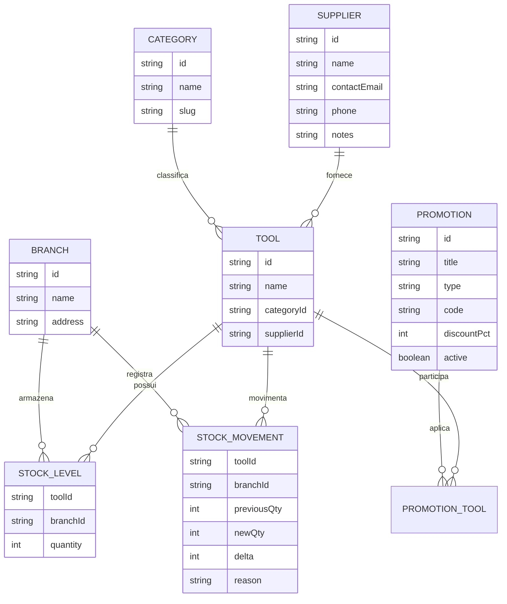

# Plano de reorganizacao do fluxo de estoque

## Contexto da conversa

Este documento consolida a analise feita sobre o fluxo de fornecedores, estoque,
promocoes, estoque por filial, filiais, ferramentas e categorias do dashboard.

O ponto levantado foi que os caminhos da sidebar e as tabs atuais nao parecem
representar bem o modelo operacional esperado. A duvida principal foi:

> Faz sentido ter `Filiais` na sidebar, listar as filiais e, ao clicar em uma
> filial, carregar o estoque daquela filial? E manter `Estoque Geral` como o
> estoque consolidado de todas as filiais misturadas?

A decisao tomada foi manter duas visoes irmas:

- `Estoque Geral`: visao centralizada e agregada de todas as filiais.
- `Estoque por Filiais`: visao operacional por filial, com tabs para alternar
  entre as filiais.

Tambem foi decidido que o escopo deve ser o fluxo completo:

- reorganizar navegacao;
- corrigir a semantica das telas de estoque;
- criar estoque por filial em tabs;
- criar rota direta de estoque por filial;
- implementar CRUD e paginas de detalhe para fornecedores;
- implementar CRUD e paginas de detalhe para categorias;
- manter promocoes por ferramenta por enquanto, melhorando a clareza do escopo.

Antes de qualquer alteracao no app, este arquivo registra o diagnostico, o plano
e os criterios de validacao.

## Diagnostico do estado atual

### Navegacao atual

A sidebar atual esta organizada assim:

- `Dashboard`
- `Estoque`
  - `Ferramentas`
  - `Estoque por Filial`
  - `Promocoes`
- `Configuracoes`
  - `Categorias` marcado como em breve
  - `Fornecedores` marcado como em breve
  - `Filiais`

Rotas relevantes existentes:

- `/dashboard`
- `/dashboard/tools`
- `/dashboard/tools/new`
- `/dashboard/tools/[id]`
- `/dashboard/tools/[id]/edit`
- `/dashboard/tools/[id]/stock`
- `/dashboard/stock`
- `/dashboard/promotions`
- `/dashboard/promotions/new`
- `/dashboard/promotions/[id]/edit`
- `/dashboard/branches`
- `/dashboard/branches/new`
- `/dashboard/branches/[id]/edit`

Nao existem atualmente rotas navegaveis para:

- `/dashboard/suppliers`
- `/dashboard/categories`

### Problemas encontrados

#### 1. `Estoque por Filial` nao comeca por filial

A rota `/dashboard/stock` mostra uma visao agregada por ferramenta, somando
quantidades de todas as filiais. Ela mostra detalhes por filial, mas a entrada
mental da tela e a ferramenta, nao a filial.

Na pratica, essa tela esta mais proxima de `Estoque Geral` do que de
`Estoque por Filial`.

#### 2. O ajuste de estoque fica escondido dentro de ferramentas

O fluxo atual e:

```text
Estoque -> clicar em ferramenta -> /dashboard/tools/[id]/stock
```

A URL de ajuste fica dentro de `tools`, mesmo quando o usuario veio da area de
estoque. Isso causa um efeito estranho nas tabs: a tela e operacionalmente de
estoque, mas a rota pertence ao grupo de ferramentas.

#### 3. `Filiais` e tratada apenas como cadastro

Hoje `Filiais` lista nome, endereco e acoes de editar/remover. Nao existe um
caminho natural:

```text
Filiais -> escolher filial -> ver estoque da filial
```

Isso quebra o modelo mental de operacao em loja, onde a filial costuma ser uma
entrada natural para conferir disponibilidade, ajustar quantidade e entender o
estoque local.

#### 4. `Fornecedores` existe no banco, mas nao existe como fluxo

Fornecedores aparecem:

- no schema do banco;
- no formulario de ferramenta;
- em contagens do dashboard;
- na sidebar, como item desabilitado.

Mas nao ha CRUD de fornecedores. Isso cria uma sensacao de funcionalidade
incompleta: o sistema permite escolher fornecedor em ferramentas, mas nao
permite cadastrar, editar ou revisar fornecedores pela interface.

#### 5. `Categorias` tambem aparece como promessa incompleta

Categorias sao usadas no catalogo de ferramentas, mas estao marcadas como
`em breve` na sidebar. Assim como fornecedores, elas devem virar cadastro real
ou ser removidas da navegacao ate existir fluxo.

Como o objetivo escolhido foi fluxo completo, a recomendacao e implementar
categorias como cadastro real.

#### 6. Promocoes funcionam, mas o escopo nao fica claro

O modelo atual de promocoes e por ferramenta. Isso sera mantido por enquanto.

O problema e que a listagem mostra informacoes resumidas demais, como contagem
de ferramentas, sem deixar claro o impacto operacional da promocao. Para o
usuario, deveria ficar evidente quais ferramentas estao afetadas e se a
promocao e automatica ou cupom.

#### 7. Dashboard mostra dados que nem sempre sao acionaveis

Cards como fornecedores, categorias, ferramentas, filiais e estoque total
aparecem como metricas, mas nem todos levam a fluxos completos.

Depois da reorganizacao, os cards devem apontar para destinos reais quando
forem clicaveis, ou ficar claramente informativos quando nao forem.

## Modelo mental desejado

O sistema deve representar tres perspectivas diferentes sem mistura-las.

### 1. Perspectiva de estoque geral

Pergunta respondida:

> Quanto temos desta ferramenta somando todas as filiais?

Tela esperada:

```text
/dashboard/stock
```

Nome exibido:

```text
Estoque Geral
```

Comportamento:

- lista ferramentas;
- mostra quantidade total;
- mostra resumo por filial;
- permite acessar ajuste de estoque;
- permite filtrar por busca, categoria e status de estoque.

### 2. Perspectiva de estoque por filial

Pergunta respondida:

> O que existe nesta filial especifica?

Tela esperada:

```text
/dashboard/stock/branches
```

Comportamento:

- mostra tabs com as filiais;
- ao selecionar uma filial, lista as ferramentas daquela filial;
- mostra quantidade local;
- permite ajuste de estoque daquela ferramenta naquela filial;
- permite busca/filtro dentro da filial selecionada.

Tambem deve existir rota direta:

```text
/dashboard/branches/[id]/stock
```

Essa rota deve abrir o estoque da filial especifica, permitindo link direto a
partir da lista de filiais.

### 3. Perspectiva de catalogo

Pergunta respondida:

> Quais ferramentas existem no catalogo e como elas estao cadastradas?

Tela esperada:

```text
/dashboard/tools
```

Comportamento:

- cadastro e edicao da ferramenta;
- exibicao de categoria e fornecedor;
- acao explicita `Gerenciar estoque`;
- detalhe da ferramenta com resumo de estoque por filial.

## Diagramas

### Fluxo atual

```mermaid
flowchart TD
  Sidebar[Sidebar atual]

  Sidebar --> Dashboard[Dashboard]
  Sidebar --> EstoqueGrupo[Grupo Estoque]
  Sidebar --> ConfigGrupo[Grupo Configuracoes]

  EstoqueGrupo --> Ferramentas[Ferramentas]
  EstoqueGrupo --> EstoquePorFilialLabel[Estoque por Filial]
  EstoqueGrupo --> Promocoes[Promocoes]

  ConfigGrupo --> Categorias[Categorias em breve]
  ConfigGrupo --> Fornecedores[Fornecedores em breve]
  ConfigGrupo --> Filiais[Filiais]

  EstoquePorFilialLabel --> StockPage[/dashboard/stock]
  StockPage --> Agregado[Lista ferramentas com estoque agregado]
  Agregado --> ToolStock[/dashboard/tools/[id]/stock]

  Filiais --> BranchList[Lista filiais]
  BranchList --> BranchEdit[Editar filial]

  Fornecedores --> SemCRUD[Nao ha CRUD]
  Categorias --> SemCRUDCat[Nao ha CRUD navegavel]
```

### Fluxo proposto

```mermaid
flowchart TD
  Sidebar[Sidebar proposta]

  Sidebar --> Estoque[Estoque]
  Sidebar --> Catalogo[Catalogo]
  Sidebar --> Cadastros[Cadastros]

  Estoque --> Geral[Estoque Geral]
  Estoque --> PorFiliais[Estoque por Filiais]
  Estoque --> Movimentacoes[Movimentacoes futuro]

  PorFiliais --> TabA[Tab Filial A]
  PorFiliais --> TabB[Tab Filial B]
  PorFiliais --> TabC[Tab Filial C]

  Catalogo --> Ferramentas[Ferramentas]
  Catalogo --> Promocoes[Promocoes]

  Cadastros --> Filiais[Filiais]
  Cadastros --> Fornecedores[Fornecedores]
  Cadastros --> Categorias[Categorias]

  Filiais --> FilialDetalhe[Detalhe da filial]
  FilialDetalhe --> EstoqueFilial[/dashboard/branches/[id]/stock]

  Geral --> Ajuste[Ajustar estoque]
  PorFiliais --> Ajuste
  Ferramentas --> AjusteFerramenta[Gerenciar estoque da ferramenta]
```

### Relacao de entidades



## Depoimentos simulados de uso

Estes depoimentos nao sao reais. Eles representam dores provaveis de usuarios
com base no fluxo atual.

### Operador de loja

> Quero ver o estoque da Filial Centro, mas quando entro em estoque eu vejo uma
> lista de ferramentas misturando todas as filiais. Preciso descobrir onde esta
> o detalhe da minha filial.

### Gerente de estoque

> Para ajustar uma quantidade, eu entro em estoque, clico numa ferramenta e vou
> parar numa rota de ferramentas. Parece que sai do fluxo de estoque, mesmo eu
> ainda estando ajustando estoque.

### Administrador

> O sistema me mostra fornecedores no cadastro de ferramenta, mas nao encontro
> onde cadastrar ou corrigir um fornecedor.

### Usuario de promocoes

> Vejo que uma promocao afeta tres ferramentas, mas preciso saber rapidamente
> quais sao essas ferramentas antes de ativar ou editar.

## Plano de implementacao

### 1. Reorganizar sidebar

Alterar a arquitetura da sidebar para:

- `Estoque`
  - `Estoque Geral`
  - `Estoque por Filiais`
  - `Movimentacoes` como futuro ou oculto se nao existir tela
- `Catalogo`
  - `Ferramentas`
  - `Promocoes`
- `Cadastros`
  - `Filiais`
  - `Fornecedores`
  - `Categorias`

Regras:

- nao deixar item clicavel sem rota;
- nao exibir `em breve` para fornecedores e categorias depois que os CRUDs
  forem implementados;
- manter estado ativo correto da sidebar para subrotas;
- evitar duplicidade entre sidebar e tabs.

### 2. Transformar `/dashboard/stock` em `Estoque Geral`

Manter a rota:

```text
/dashboard/stock
```

Mas ajustar:

- titulo para `Estoque Geral`;
- descricao para explicar que e a soma de todas as filiais;
- labels que hoje sugerem `por filial`;
- chamada de acao para deixar claro que a linha permite gerenciar o estoque da
  ferramenta nas filiais;
- estado ativo da navegacao como `Estoque Geral`.

Essa tela deve continuar usando o comportamento atual de agregacao:

```text
total da ferramenta = soma de stock_level.quantity em todas as filiais
```

### 3. Criar `/dashboard/stock/branches`

Criar uma nova tela:

```text
/dashboard/stock/branches
```

Comportamento:

- carregar lista de filiais;
- renderizar tabs com as filiais;
- selecionar a primeira filial por padrao quando nenhuma estiver escolhida;
- permitir selecionar filial via query param para link compartilhavel;
- listar ferramentas com quantidade naquela filial;
- mostrar zero quando a ferramenta ainda nao tiver linha em `stock_level` para
  aquela filial;
- permitir ajustar estoque diretamente no contexto da filial.

Formato recomendado de URL:

```text
/dashboard/stock/branches?branch=<branchId>
```

### 4. Criar rota direta de estoque da filial

Criar:

```text
/dashboard/branches/[id]/stock
```

Essa rota deve:

- validar se a filial existe;
- carregar a mesma experiencia da filial selecionada;
- permitir voltar para a lista de filiais;
- permitir ir para `Estoque por Filiais`;
- manter o contexto operacional da filial.

Na lista de filiais, cada linha deve ter acao clara:

```text
Ver estoque
```

### 5. Expor `Gerenciar estoque` em ferramentas

Na listagem e no detalhe de ferramentas:

- adicionar acao explicita `Gerenciar estoque`;
- apontar para a tela atual de estoque da ferramenta ou para a nova rota
  consolidada, conforme a implementacao final;
- nao depender apenas de clique em linha.

Opcao conservadora:

```text
/dashboard/tools/[id]/stock
```

Opcao futura mais consistente:

```text
/dashboard/stock/tools/[id]
```

Para reduzir risco, a primeira implementacao pode manter a rota atual e apenas
corrigir labels, breadcrumbs e estado ativo das tabs/sidebar.

### 6. Implementar CRUD de fornecedores

Criar fluxo completo:

```text
/dashboard/suppliers
/dashboard/suppliers/new
/dashboard/suppliers/[id]
/dashboard/suppliers/[id]/edit
```

Funcionalidades:

- listar fornecedores;
- buscar por nome, email ou telefone;
- criar fornecedor;
- editar fornecedor;
- remover fornecedor quando permitido;
- mostrar quantidade de ferramentas vinculadas;
- detalhe com dados de contato, observacoes e ferramentas vinculadas;
- nos formularios de ferramenta, continuar usando fornecedores como select.

Regras:

- se fornecedor for removido, ferramentas devem manter integridade com
  `supplierId` nulo, seguindo o comportamento atual do schema;
- impedir exclusao destrutiva se a regra de negocio preferir preservar cadastro
  historico; se nao houver essa regra, seguir `onDelete: set null`;
- aplicar autorizacao igual aos demais cadastros: leitura com sessao, mutacao
  para admin.

### 7. Implementar CRUD de categorias

Criar fluxo completo:

```text
/dashboard/categories
/dashboard/categories/new
/dashboard/categories/[id]
/dashboard/categories/[id]/edit
```

Funcionalidades:

- listar categorias;
- buscar por nome;
- criar categoria;
- editar categoria;
- remover categoria quando permitido;
- mostrar quantidade de ferramentas vinculadas;
- detalhe com ferramentas vinculadas.

Regras:

- antes de remover categoria, validar impacto em ferramentas vinculadas;
- se o schema atual nao permitir `categoryId` nulo, bloquear remocao quando
  houver ferramentas usando a categoria;
- manter categorias disponiveis nos filtros e formularios de ferramentas.

### 8. Melhorar promocoes sem mudar o escopo do banco

Manter promocoes por ferramenta nesta etapa.

Melhorias:

- exibir coluna ou resumo de `Escopo`;
- mostrar nomes das ferramentas afetadas, ao menos as primeiras;
- diferenciar claramente `Promocao automatica` de `Cupom`;
- revisar textos de ativacao/edicao para deixar claro o impacto;
- manter regras atuais de datas, desconto e associacao com ferramentas.

Nao incluir agora:

- promocao por filial;
- promocao por categoria;
- promocao global;
- promocao por fornecedor.

Esses escopos podem ser planejados depois.

### 9. Padronizar filtros e query params

Padronizar nomes e comportamento entre telas.

Recomendacao:

- `search` para busca textual;
- `category` para categoria;
- `supplier` para fornecedor;
- `branch` para filial;
- `status` para status;
- `type` para tipo de promocao;
- `sort` para ordenacao.

Evitar mistura entre portugues e ingles nos query params, como `categoria` em
uma tela e `category` em outra.

### 10. Dashboard

Revisar cards do dashboard:

- `Estoque total` deve apontar para `Estoque Geral`;
- `Filiais` deve apontar para `Filiais`;
- `Fornecedores` deve apontar para `Fornecedores` depois do CRUD;
- `Categorias` deve apontar para `Categorias` depois do CRUD;
- cards clicaveis devem ter affordance visual clara;
- cards nao clicaveis devem ser apenas metricas.

## Testes e validacao

### Validacao de navegacao

- Abrir `/dashboard`.
- Confirmar grupos da sidebar:
  - `Estoque`;
  - `Catalogo`;
  - `Cadastros`.
- Confirmar que `Estoque Geral` ativa em `/dashboard/stock`.
- Confirmar que `Estoque por Filiais` ativa em `/dashboard/stock/branches`.
- Confirmar que `Filiais` ativa em `/dashboard/branches`.
- Confirmar que fornecedores e categorias nao aparecem mais como `em breve`
  apos seus CRUDs existirem.

### Validacao de estoque geral

- Abrir `/dashboard/stock`.
- Confirmar titulo `Estoque Geral`.
- Confirmar que a quantidade total de uma ferramenta e a soma das filiais.
- Confirmar que o detalhamento por filial continua visivel.
- Confirmar que a acao de ajuste continua funcionando.
- Confirmar que o historico de movimentacao continua sendo gravado.

### Validacao de estoque por filiais

- Abrir `/dashboard/stock/branches`.
- Confirmar que tabs de filiais aparecem.
- Trocar entre filiais.
- Confirmar que a lista muda conforme a filial.
- Confirmar que ferramentas sem `stock_level` naquela filial aparecem com
  quantidade zero, se essa for a regra implementada.
- Ajustar estoque em uma filial.
- Confirmar que o ajuste reflete:
  - na filial selecionada;
  - no estoque geral;
  - no historico de movimentacoes.

### Validacao da rota direta de filial

- Abrir `/dashboard/branches`.
- Clicar em `Ver estoque` em uma filial.
- Confirmar navegacao para `/dashboard/branches/[id]/stock`.
- Confirmar que a filial correta esta carregada.
- Confirmar que e possivel voltar para a lista de filiais.

### Validacao de fornecedores

- Abrir `/dashboard/suppliers`.
- Criar fornecedor.
- Editar fornecedor.
- Ver detalhe do fornecedor.
- Confirmar ferramentas vinculadas.
- Usar fornecedor no cadastro de uma ferramenta.
- Remover fornecedor conforme regra de negocio definida.
- Confirmar que ferramentas vinculadas nao quebram.

### Validacao de categorias

- Abrir `/dashboard/categories`.
- Criar categoria.
- Editar categoria.
- Ver detalhe da categoria.
- Confirmar ferramentas vinculadas.
- Usar categoria no cadastro e filtros de ferramenta.
- Tentar remover categoria com ferramentas vinculadas e validar o comportamento
  esperado.

### Validacao de promocoes

- Abrir `/dashboard/promotions`.
- Confirmar que o escopo por ferramenta fica claro.
- Criar promocao por ferramenta.
- Editar promocao.
- Confirmar exibicao das ferramentas afetadas.
- Confirmar que promocoes continuam sem escopo por filial nesta etapa.

### Checks finais

Executar:

```bash
bun x ultracite check
```

Se houver servidor de desenvolvimento disponivel, validar no navegador:

- desktop;
- mobile;
- estados vazios;
- tabelas com muitos registros;
- tabs com muitas filiais;
- permissoes de usuario sem admin.

## Riscos e cuidados

### Risco: duplicar experiencias de estoque

`Estoque Geral`, `Estoque por Filiais` e `Ferramenta -> Gerenciar estoque`
podem parecer tres telas para a mesma coisa.

Mitigacao:

- cada tela deve responder uma pergunta diferente;
- textos de titulo e descricao devem ser especificos;
- acoes devem deixar claro o contexto.

### Risco: tabs com muitas filiais

Se houver muitas filiais, tabs horizontais podem ficar ruins.

Mitigacao:

- usar scroll horizontal;
- considerar select/combobox em telas menores;
- manter query param `branch` para link direto.

### Risco: fornecedores e categorias exigirem regras de exclusao diferentes

Fornecedores usam `onDelete: set null` em ferramentas. Categorias podem nao
seguir a mesma regra.

Mitigacao:

- confirmar schema antes de implementar exclusao;
- bloquear exclusao de categoria em uso se a FK exigir categoria obrigatoria;
- mostrar mensagem clara ao usuario.

### Risco: promocao parecer global

Como promocoes continuam por ferramenta, a UI precisa evitar ambiguidade.

Mitigacao:

- exibir `Escopo: ferramentas especificas`;
- mostrar nomes das ferramentas;
- nao usar textos como `toda loja` ou `geral` nesta etapa.

## Ordem recomendada de implementacao

1. Reorganizar sidebar e labels de `Estoque Geral`.
2. Criar `/dashboard/stock/branches` com tabs por filial.
3. Criar `/dashboard/branches/[id]/stock` e acao `Ver estoque` em filiais.
4. Expor `Gerenciar estoque` em ferramentas.
5. Implementar CRUD e detalhe de fornecedores.
6. Implementar CRUD e detalhe de categorias.
7. Melhorar clareza da listagem/formulario de promocoes.
8. Padronizar filtros e query params.
9. Revisar dashboard e cards clicaveis.
10. Rodar checks e validar no navegador.

## Decisoes travadas

- O arquivo de plano fica na raiz como `PLANO-ESTOQUE.md`.
- `Estoque Geral` centraliza todas as filiais.
- `Estoque por Filiais` mostra estoque separado por filial com tabs.
- Tambem havera rota direta por filial.
- Sidebar deve usar o modelo:
  - `Estoque`;
  - `Catalogo`;
  - `Cadastros`.
- Fornecedores terao CRUD e detalhe.
- Categorias terao CRUD e detalhe.
- Promocoes continuam por ferramenta nesta etapa.
- Nenhuma alteracao no app deve ser feita antes da revisao deste plano.

