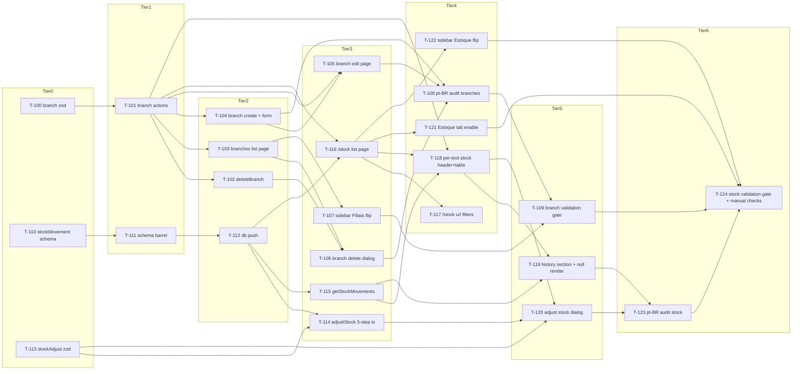

# Build Site — emach-dashboard Phase 2

**25 tasks across 6 tiers from 2 kits (139 acceptance criteria covered).**

Phase 1 (T-001–T-068) is shipped. This site covers Phase 2 only: branches CRUD (Kit 6, 44 ACs) and stock management (Kit 7, 95 ACs). All Phase 1 preconditions (`requireRole`, tool/branch/stockLevel schemas, sidebar scaffolding with disabled "Filiais" and "Estoque por Filial" items, inventory tabs with disabled "Estoque" trigger) are in place and must NOT be re-planned.

Task ID namespace starts at T-100 to avoid collision with Phase 1.

---

## Tier 0 — No Phase 2 Dependencies (Start Here)

| Task | Title | Kit | Requirement | Effort |
|---|---|---|---|---|
| T-100 | Zod schema for branch create/update (`name`, `address`) | cavekit-branches-crud.md | R1 | S |
| T-110 | Create `stock_movement` schema file with relations + indexes | cavekit-stock-management.md | R1 | M |
| T-113 | Zod `stockAdjustmentSchema` with reason + reasonNote refinements | cavekit-stock-management.md | R9 | M |

Three tasks launch in parallel: the two schema files (Drizzle + Zod) for stock management are independent from anything else, and the branch Zod schema is pure validation logic with no runtime dependencies.

---

## Tier 1 — Depends on Tier 0

| Task | Title | Kit | Requirement | blockedBy | Effort |
|---|---|---|---|---|---|
| T-101 | Branch server actions: list/get/create/update + return shape + requireRole | cavekit-branches-crud.md | R2 (AC1–6, AC8) | T-100 | M |
| T-111 | Re-export `stockMovement` from schema barrel + include in `createDb()` | cavekit-stock-management.md | R2 | T-110 | S |

---

## Tier 2 — Depends on Tier 1

| Task | Title | Kit | Requirement | blockedBy | Effort |
|---|---|---|---|---|---|
| T-102 | `deleteBranch` action: cascade + triple `revalidatePath` including `'/dashboard/tools'` `'layout'` | cavekit-branches-crud.md | R2 (AC7) | T-101 | S |
| T-103 | `/dashboard/branches` list page (Server Component, table, empty state, "Nova filial" button) | cavekit-branches-crud.md | R3 | T-101 | M |
| T-104 | `/dashboard/branches/new` create page + shared `branch-form.tsx` with `mode` prop | cavekit-branches-crud.md | R4 | T-101 | M |
| T-112 | Run `bun --cwd packages/db run db:push` and verify table + indexes in local Supabase | cavekit-stock-management.md | R3 | T-111 | S |

---

## Tier 3 — Depends on Tier 2

| Task | Title | Kit | Requirement | blockedBy | Effort |
|---|---|---|---|---|---|
| T-105 | `/dashboard/branches/[id]/edit` page reusing `branch-form.tsx` with `notFound()` on null | cavekit-branches-crud.md | R5 | T-101, T-104 | M |
| T-106 | Delete confirmation dialog triggered from R3 Acoes column with pt-BR warning + toast | cavekit-branches-crud.md | R6 | T-102, T-103 | M |
| T-107 | Remove `disabled: true` flag from "Filiais" sidebar item (Configurações group) | cavekit-branches-crud.md | R7 | T-103 | S |
| T-114 | `adjustStock` server action: 5-step transactional sequence (INSERT ON CONFLICT → SELECT FOR UPDATE → compute → UPDATE → INSERT movement) + revalidatePath pair | cavekit-stock-management.md | R8 | T-112, T-113 | L |
| T-115 | `getStockMovements(toolId, limit)` query with LEFT JOINs on branch + user, ordered DESC | cavekit-stock-management.md | R10 | T-112 | M |
| T-116 | `/dashboard/stock` consolidated list page: table, row click, empty state, zero-stock handling (Server Component) | cavekit-stock-management.md | R5 (AC1–2, 6–10) | T-112, T-101 | M |

---

## Tier 4 — Depends on Tier 3

| Task | Title | Kit | Requirement | blockedBy | Effort |
|---|---|---|---|---|---|
| T-108 | pt-BR audit for branches routes (labels, buttons, column headers, error leakage grep) | cavekit-branches-crud.md | R8 | T-104, T-105, T-106 | S |
| T-117 | URL query param filters for `/dashboard/stock`: `?q=`, `?categoria=`, `?ordem=` | cavekit-stock-management.md | R5 (AC3–5) | T-116 | M |
| T-118 | `/dashboard/tools/[id]/stock` page: header + "Estoque por filial" table listing every branch (with zero-stock rows) | cavekit-stock-management.md | R6 (AC1–4, AC10) | T-101, T-115, T-116 | M |
| T-121 | Enable Estoque tab in `inventory-tabs.tsx` (remove disabled, wire to `/dashboard/stock`, path-driven value) | cavekit-stock-management.md | R4 | T-116 | S |
| T-122 | Remove `disabled: true` flag from "Estoque por Filial" sidebar item (Estoque group) | cavekit-stock-management.md | R11 | T-116 | S |

---

## Tier 5 — Depends on Tier 4

| Task | Title | Kit | Requirement | blockedBy | Effort |
|---|---|---|---|---|---|
| T-109 | Validation gate for branches scope: `ultracite check` + `bun --filter=web run build` | cavekit-branches-crud.md | R9 | T-107, T-108 | S |
| T-119 | "Historico de movimentacoes" section on per-tool stock page with null-branch "Filial removida" rendering + empty state | cavekit-stock-management.md | R6 (AC5–9) | T-115, T-118 | M |
| T-120 | Adjust stock dialog (client component): current qty, new qty input, motivo Select, conditional Observacao textarea, submit + toast | cavekit-stock-management.md | R7 | T-113, T-114, T-118 | M |

---

## Tier 6 — Final Validation

| Task | Title | Kit | Requirement | blockedBy | Effort |
|---|---|---|---|---|---|
| T-123 | pt-BR audit for stock routes (reason enum labels, section headers, English leakage grep) | cavekit-stock-management.md | R12 | T-119, T-120 | S |
| T-124 | Validation gate for stock scope: `ultracite check` + `bun --filter=web run build` + manual concurrency check (R8 AC14) + manual end-to-end smoke (R13 AC3) | cavekit-stock-management.md | R8 (AC14), R13 | T-109, T-121, T-122, T-123 | M |

T-124 bundles the two `[manual-check]` acceptance criteria from R8 (two concurrent admin sessions) and R13 (end-to-end create-branch → adjust → history smoke) with the automated validation gate. These manual checks cannot be automated and are the final gate before the phase closes.

---

## Summary

| Tier | Tasks | S | M | L |
|---|---|---|---|---|
| 0 | 3 | 1 | 2 | 0 |
| 1 | 2 | 1 | 1 | 0 |
| 2 | 4 | 2 | 2 | 0 |
| 3 | 6 | 1 | 4 | 1 |
| 4 | 5 | 3 | 2 | 0 |
| 5 | 3 | 0 | 3 | 0 |
| 6 | 2 | 1 | 1 | 0 |
| **Total** | **25** | **9** | **15** | **1** |

Single L task (T-114) is preserved per builder note — the 5-step transactional sequence in R8 is atomic and cannot be split without breaking correctness.

---

## Coverage Matrix

| Kit | Req | Criterion (abbreviated ≤70 chars) | Task(s) | Status |
|---|---|---|---|---|
| 6 | R1 | Zod schema exported from branches feature folder | T-100 | COVERED |
| 6 | R1 | `name` required string, 2–120, trimmed | T-100 | COVERED |
| 6 | R1 | `address` optional string, max 500, empty→undefined | T-100 | COVERED |
| 6 | R1 | Rejects empty name with "Nome obrigatorio" | T-100 | COVERED |
| 6 | R1 | Rejects <2 char name with "Nome muito curto" | T-100 | COVERED |
| 6 | R2 | `actions.ts` exports list/get/create/update/delete | T-101, T-102 | COVERED |
| 6 | R2 | Mutations call `requireRole('admin')` at top | T-101, T-102 | COVERED |
| 6 | R2 | `listBranches` orders by `name` ascending | T-101 | COVERED |
| 6 | R2 | `getBranch` returns null for missing id (no throw) | T-101 | COVERED |
| 6 | R2 | Mutations use `nanoid()` + `new Date()` for updatedAt | T-101, T-102 | COVERED |
| 6 | R2 | Create/update validate input via R1 schema | T-101 | COVERED |
| 6 | R2 | `deleteBranch` cascade + triple revalidatePath ('/tools' layout) | T-102 | COVERED |
| 6 | R2 | Actions return `{ok:true}` / `{ok:false,error}` shape | T-101, T-102 | COVERED |
| 6 | R3 | `/dashboard/branches` lists every branch | T-103 | COVERED |
| 6 | R3 | Columns: Nome, Endereco, Criado em, Acoes | T-103 | COVERED |
| 6 | R3 | "Nova filial" button → `/dashboard/branches/new` | T-103 | COVERED |
| 6 | R3 | Empty state "Nenhuma filial cadastrada" | T-103 | COVERED |
| 6 | R3 | Server Component calls `listBranches()` directly | T-103 | COVERED |
| 6 | R4 | `/dashboard/branches/new` form with Nome + Endereco | T-104 | COVERED |
| 6 | R4 | Submit calls `createBranch`, redirect to list on success | T-104 | COVERED |
| 6 | R4 | Inline pt-BR validation errors from R1 schema | T-104 | COVERED |
| 6 | R4 | "Cancelar" returns to list without submitting | T-104 | COVERED |
| 6 | R5 | `/edit` Server Component loads via `getBranch(id)` | T-105 | COVERED |
| 6 | R5 | `null` branch → `notFound()` response | T-105 | COVERED |
| 6 | R5 | Shares `branch-form.tsx` with `defaultValues` + `mode` props | T-105 | COVERED |
| 6 | R5 | Submit calls `updateBranch(id)`, redirect to list | T-105 | COVERED |
| 6 | R5 | Page header shows branch name | T-105 | COVERED |
| 6 | R6 | Confirmation dialog triggered from Acoes column | T-106 | COVERED |
| 6 | R6 | Dialog title includes branch name | T-106 | COVERED |
| 6 | R6 | Warning body explains stock removed + history preserved | T-106 | COVERED |
| 6 | R6 | Buttons: Cancelar + Deletar calling `deleteBranch` | T-106 | COVERED |
| 6 | R6 | Success toast "Filial removida" | T-106 | COVERED |
| 6 | R6 | Error keeps dialog open showing message | T-106 | COVERED |
| 6 | R7 | Remove `disabled:true` from Filiais item in Configurações | T-107 | COVERED |
| 6 | R7 | Label stays "Filiais" (pt-BR) | T-107 | COVERED |
| 6 | R7 | href stays `/dashboard/branches` | T-107 | COVERED |
| 6 | R7 | Existing `isActive()` handles highlight — no change | T-107 | COVERED |
| 6 | R7 | No new groups / no other nav items touched / no icons | T-107 | COVERED |
| 6 | R7 | Clicking navigates to `/dashboard/branches` no 404 | T-107 | COVERED |
| 6 | R8 | All form labels/buttons/headers/empty in pt-BR | T-108 | COVERED |
| 6 | R8 | Zero English leakage (Create/Save/Name/Address/Delete) | T-108 | COVERED |
| 6 | R8 | Validation error tone matches tools CRUD | T-108 | COVERED |
| 6 | R9 | `bun x ultracite check` exits 0 | T-109 | COVERED |
| 6 | R9 | `bun --filter=web run build` exits 0 with branches routes | T-109 | COVERED |
| 7 | R1 | File `packages/db/src/schema/stock-movements.ts` exists | T-110 | COVERED |
| 7 | R1 | Exports `stockMovement` as Drizzle pgTable | T-110 | COVERED |
| 7 | R1 | All columns match Column Specification exactly | T-110 | COVERED |
| 7 | R1 | `toolId` FK `set null`, nullable | T-110 | COVERED |
| 7 | R1 | `branchId` FK `set null`, nullable | T-110 | COVERED |
| 7 | R1 | `actorId` FK `set null`, nullable | T-110 | COVERED |
| 7 | R1 | `id` is `text` (not serial/uuid) per data-model R11 | T-110 | COVERED |
| 7 | R1 | `createdAt` uses `timestamp().defaultNow().notNull()` | T-110 | COVERED |
| 7 | R1 | Composite index `stock_movement_tool_created_idx` DESC | T-110 | COVERED |
| 7 | R1 | Separate index on `actor_id` | T-110 | COVERED |
| 7 | R1 | Drizzle `stockMovementRelations` exported (tool/branch/actor) | T-110 | COVERED |
| 7 | R1 | `StockMovement = typeof stockMovement.$inferSelect` exported | T-110 | COVERED |
| 7 | R2 | `schema/index.ts` re-exports `./stock-movements` | T-111 | COVERED |
| 7 | R2 | `createDb()` schema object includes `stockMovement` | T-111 | COVERED |
| 7 | R2 | `bun --filter=@emach/db run build` compiles clean | T-111 | COVERED |
| 7 | R3 | `bun --cwd packages/db run db:push` exits 0 | T-112 | COVERED |
| 7 | R3 | `stock_movement` table exists in public schema | T-112 | COVERED |
| 7 | R3 | Both indexes exist on the table | T-112 | COVERED |
| 7 | R3 | No destructive migration warnings | T-112 | COVERED |
| 7 | R4 | `inventory-tabs.tsx` removes disabled/aria-disabled on Estoque | T-121 | COVERED |
| 7 | R4 | Estoque renders as `<Link>` to `/dashboard/stock` | T-121 | COVERED |
| 7 | R4 | `tabIndex={-1}` removed from Estoque trigger | T-121 | COVERED |
| 7 | R4 | Tab `value` prop is `stock` | T-121 | COVERED |
| 7 | R4 | Tabs parent `value` resolves from `usePathname()` | T-121 | COVERED |
| 7 | R4 | Promocoes tab remains disabled | T-121 | COVERED |
| 7 | R5 | `/dashboard/stock` renders list of all tools | T-116 | COVERED |
| 7 | R5 | Row shows thumb, Nome, SKU, Total, Filiais popover | T-116 | COVERED |
| 7 | R5 | Search input `?q=` filters by name case-insensitive | T-117 | COVERED |
| 7 | R5 | Category filter `?categoria=` | T-117 | COVERED |
| 7 | R5 | Sort selector `?ordem=` (Nome/Maior/Menor) | T-117 | COVERED |
| 7 | R5 | Row click navigates to `/dashboard/tools/[id]/stock` | T-116 | COVERED |
| 7 | R5 | Empty state "Nenhuma ferramenta cadastrada" | T-116 | COVERED |
| 7 | R5 | Zero stockLevel: Total=0, "Nenhuma filial com estoque" | T-116 | COVERED |
| 7 | R5 | Server Component, direct DB query | T-116 | COVERED |
| 7 | R5 | No client-side editing; changes redirect to per-tool page | T-116 | COVERED |
| 7 | R6 | Route `/dashboard/tools/[id]/stock` with `notFound()` on missing tool | T-118 | COVERED |
| 7 | R6 | Header shows tool name, SKU, link back to /stock | T-118 | COVERED |
| 7 | R6 | "Estoque por filial" table lists every branch (even w/o stock row) | T-118 | COVERED |
| 7 | R6 | Row columns: Filial, Qtd atual, Ultima atualizacao, Acoes | T-118 | COVERED |
| 7 | R6 | Historico section shows last 50 movements DESC | T-119 | COVERED |
| 7 | R6 | Movement columns: Data, Filial, Anterior, Nova, Delta (color), Motivo, Usuario, Nota | T-119 | COVERED |
| 7 | R6 | Null `branchId` renders "Filial removida" muted pt-BR | T-119 | COVERED |
| 7 | R6 | Null `toolId` row still renders (no crash) | T-119 | COVERED |
| 7 | R6 | Empty history "Nenhuma movimentacao registrada" | T-119 | COVERED |
| 7 | R6 | Page is a Server Component | T-118 | COVERED |
| 7 | R7 | Dialog triggered from Ajustar button in R6 table | T-120 | COVERED |
| 7 | R7 | Title "Ajustar estoque — {branchName}" | T-120 | COVERED |
| 7 | R7 | Body: current qty readonly, new qty input, motivo Select, observacao textarea conditional | T-120 | COVERED |
| 7 | R7 | Select options map pt-BR labels ↔ enum values, empty default | T-120 | COVERED |
| 7 | R7 | Motivo='outro' requires observacao w/ pt-BR error | T-120 | COVERED |
| 7 | R7 | Buttons "Salvar ajuste" + "Cancelar" | T-120 | COVERED |
| 7 | R7 | Success: dialog closes, table + history update, toast "Estoque atualizado" | T-120 | COVERED |
| 7 | R7 | Error: dialog stays open, inline message | T-120 | COVERED |
| 7 | R8 | `adjustStock(input)` exported from stock folder | T-114 | COVERED |
| 7 | R8 | Calls `requireRole('admin')` + reads `session.user.id` | T-114 | COVERED |
| 7 | R8 | Validates input via R9 Zod schema before opening tx | T-114 | COVERED |
| 7 | R8 | All DB I/O inside single `db.transaction` callback | T-114 | COVERED |
| 7 | R8 | Step 1: `INSERT ... ON CONFLICT (tool_id, branch_id) DO NOTHING` | T-114 | COVERED |
| 7 | R8 | Step 2: `SELECT quantity ... FOR UPDATE` (Drizzle `.for('update')`) | T-114 | COVERED |
| 7 | R8 | Step 3: compute previousQty + delta in application code | T-114 | COVERED |
| 7 | R8 | Step 4: `UPDATE stock_level SET quantity, updated_at` | T-114 | COVERED |
| 7 | R8 | Step 5: `INSERT stock_movement` with nanoid + all fields | T-114 | COVERED |
| 7 | R8 | Transaction rollback on any throw (no partial state) | T-114 | COVERED |
| 7 | R8 | Revalidate `/dashboard/stock` + `/dashboard/tools/{id}/stock` after commit | T-114 | COVERED |
| 7 | R8 | Returns `{ok:true,data:{prev,new,delta,movementId}}` / `{ok:false}` | T-114 | COVERED |
| 7 | R8 | Zod failure short-circuits before DB | T-114 | COVERED |
| 7 | R8 | [manual-check] Two concurrent admin sessions produce sequential chained movements | T-124 | COVERED |
| 7 | R9 | `stockAdjustmentSchema` exported alongside R8 action | T-113 | COVERED |
| 7 | R9 | `toolId` + `branchId` required non-empty strings | T-113 | COVERED |
| 7 | R9 | `newQty` integer, min 0, max 999999 | T-113 | COVERED |
| 7 | R9 | `reason` optional enum (5 values) | T-113 | COVERED |
| 7 | R9 | `reasonNote` optional, max 500 | T-113 | COVERED |
| 7 | R9 | Refinement: reason='outro' → reasonNote non-empty (pt-BR error) | T-113 | COVERED |
| 7 | R9 | Inverse refinement: reason≠'outro' → reasonNote must be empty (pt-BR error) | T-113 | COVERED |
| 7 | R9 | All error messages in pt-BR | T-113 | COVERED |
| 7 | R10 | `getStockMovements(toolId, limit=50)` exported | T-115 | COVERED |
| 7 | R10 | Returns shape with id/createdAt/branchId/branchName/prev/new/delta/reason/reasonNote/actorId/actorName | T-115 | COVERED |
| 7 | R10 | Ordered by `createdAt` DESC | T-115 | COVERED |
| 7 | R10 | LEFT JOIN on branch (tolerates null branchId) | T-115 | COVERED |
| 7 | R10 | LEFT JOIN on user (tolerates null actorId) | T-115 | COVERED |
| 7 | R10 | Filters by `stock_movement.tool_id = ?` | T-115 | COVERED |
| 7 | R10 | Does NOT call `requireRole` (read open to any auth user) | T-115 | COVERED |
| 7 | R10 | Single round-trip (no N+1) | T-115 | COVERED |
| 7 | R11 | Remove `disabled:true` from "Estoque por Filial" item in Estoque group | T-122 | COVERED |
| 7 | R11 | Label stays "Estoque por Filial" (not renamed) | T-122 | COVERED |
| 7 | R11 | href stays `/dashboard/stock` | T-122 | COVERED |
| 7 | R11 | Existing `isActive()` handles state (per-tool stock keeps Ferramentas highlight) | T-122 | COVERED |
| 7 | R11 | No new groups / no other nav items touched | T-122 | COVERED |
| 7 | R11 | Clicking navigates to `/dashboard/stock` no 404 | T-122 | COVERED |
| 7 | R12 | Reason enum labels exact pt-BR mapping (5 values) | T-123 | COVERED |
| 7 | R12 | All form/button/header/empty/toast text pt-BR | T-123 | COVERED |
| 7 | R12 | Zero English leakage (Create/Save/Stock/Quantity/Reason) | T-123 | COVERED |
| 7 | R12 | Section headers "Estoque por filial" + "Historico de movimentacoes" | T-123 | COVERED |
| 7 | R13 | `bun x ultracite check` exits 0 | T-124 | COVERED |
| 7 | R13 | `bun --filter=web run build` exits 0 with all stock+branches routes | T-124 | COVERED |
| 7 | R13 | [manual-check] `bun dev` end-to-end: create branch → adjust stock → history row | T-124 | COVERED |

**Coverage: 139/139 criteria (100%)**

---

## Dependency Graph

---

## Notes for the Builder

- All Phase 1 dependencies are satisfied — `requireRole`, tool/branch/stockLevel schemas, sidebar scaffolding with disabled "Filiais" and "Estoque por Filial" placeholder items, and inventory tabs with disabled "Estoque" trigger are in place.
- Kit 7 R8 has a non-trivial 5-step transactional sequence (T-114) — treat as a single task, do not split. The ordering INSERT ON CONFLICT → SELECT FOR UPDATE → compute → UPDATE → INSERT movement is the canonical Postgres upsert-under-lock pattern and breaking it causes race conditions or duplicate-key crashes.
- Kit 7 R11 (T-122) and Kit 6 R7 (T-107) are sidebar flag flips only — 1-line edits in `app-sidebar.tsx` to remove `disabled: true`. Do NOT create new groups, do NOT add icons, do NOT rename labels.
- Kit 6 R2 `deleteBranch` (T-102) MUST revalidate `/dashboard/tools` with the `'layout'` second argument — this purges the entire tools subtree including every per-tool stock page whose branch rows go stale.
- `stock_movement.toolId`, `branchId`, and `actorId` are nullable FKs with `onDelete: 'set null'` to preserve audit trail. The history UI (T-119) must render "Filial removida" for null `branchId` and must never crash on null foreign keys.
- T-114 splits compute of `previousQty` + `delta` into application code, NOT a DB subquery/CTE — this is an explicit AC.
- T-121 (Estoque tab enable) is Tier 4, not Tier 2 — it depends on `/dashboard/stock` actually resolving (T-116) to avoid users hitting 404 when clicking the tab.
- T-122 (sidebar flip) depends on T-116 for the same 404-prevention reason.
- T-124 is the only task that bundles the two `[manual-check]` acceptance criteria (R8 concurrency + R13 end-to-end smoke) and MUST be the last task in the phase.
- T-116 depends on T-101 (`listBranches`) because the Filiais popover needs branch names, not just ids.
- T-118 depends on T-101 (`listBranches`) because the "Estoque por filial" table lists every branch even when no stock row exists — it cannot infer branches from stock alone.
