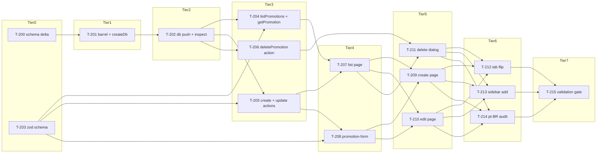

# Build Site — emach-dashboard Phase 3

**16 tasks across 7 tiers from 1 kit (122 acceptance criteria covered).**

Phase 1 (T-001–T-068) and Phase 2 (T-100–T-124) are shipped and merged. This site covers Phase 3 only: Promotions CRUD (`cavekit-promotions-crud.md`, 11 R, 122 ACs).

Task ID namespace starts at T-200 to avoid collision with Phases 1–2.

**Precondition state (already built — do NOT re-plan):**
- `requireRole('admin')` helper from `cavekit-auth-access.md` R2+R4
- `tool` table with `id`/`name` from `cavekit-data-model.md` R1
- `promotion` table scaffolded in Phase 1 via `cavekit-data-model.md` R3 — Phase 3 T-200 supersedes it (drops `toolId`, adds `type`/`code`, creates `promotion_tool`)
- `schema/index.ts` barrel and `createDb()` already export all Phase 1/2 tables — T-201 adds `promotionTool`
- Route group `(inventory)` at `apps/web/src/app/dashboard/(inventory)/` with `layout.tsx` rendering `<InventoryTabs>` is live
- `inventory-tabs.tsx` has a disabled `<TabsTrigger value="promotions">` at lines 38-46 — T-212 flips this
- `resolveActiveTab` already returns `"promotions"` for `/dashboard/promotions` pathnames — zero change needed
- `app-sidebar.tsx` NAV_GROUPS "Estoque" group has "Ferramentas" and "Estoque por Filial" — T-213 ADDS "Promoções" (new item, not a flag flip)
- `delete-branch-dialog.tsx` pattern is the blueprint for T-211

---

## Tier 0 — No Phase 3 Dependencies (Start Here)

| Task | Title | Kit | Requirement | Effort |
|---|---|---|---|---|
| T-200 | Schema delta: drop `toolId`, add `type`/`code`/`unique`, create `promotionTool` join table with composite PK + cascade FKs, update `promotionRelations` to `many`, add `promotionToolRelations` | cavekit-promotions-crud.md | R1 | M |
| T-203 | Zod discriminated-union schema: base fields + `promotion`/`promocode` variants + all cross-field refines + create-only `startsAt >= now` refine; all messages pt-BR | cavekit-promotions-crud.md | R2 | M |

Two tasks launch in parallel. T-200 is a pure schema-file edit with no runtime prerequisite; T-203 is pure validation logic with no runtime dependencies. Both are independent of any running code.

---

## Tier 1 — Depends on Tier 0

| Task | Title | Kit | Requirement | blockedBy | Effort |
|---|---|---|---|---|---|
| T-201 | Wire new exports: `schema/index.ts` re-exports `promotionTool` + relations; `createDb()` schema object includes `promotionTool` | cavekit-promotions-crud.md | R1 | T-200 | S |

---

## Tier 2 — Depends on Tier 1

| Task | Title | Kit | Requirement | blockedBy | Effort |
|---|---|---|---|---|---|
| T-202 | Run `db:push` + manual DB inspection: verify `promotion_tool` table, composite PK, `type`/`code` columns on `promotion`, absence of `tool_id` column | cavekit-promotions-crud.md | R1 | T-201 | S |

---

## Tier 3 — Depends on Tier 2 + T-203

| Task | Title | Kit | Requirement | blockedBy | Effort |
|---|---|---|---|---|---|
| T-204 | Server actions — `listPromotions` (filter by type/search, sort `createdAt DESC, id ASC`, include tools array via join) + `getPromotion` (returns row + toolIds, null on missing) | cavekit-promotions-crud.md | R3 | T-202, T-203 | M |
| T-205 | Server actions — `createPromotion` + `updatePromotion`: `requireRole`, Zod validate, title-per-type uniqueness, code uniqueness (promocode), window-aware stacking guard, `db.transaction` with `promotion_tool` sync, `revalidatePath` | cavekit-promotions-crud.md | R3 | T-202, T-203 | L |
| T-206 | Server action — `deletePromotion`: `requireRole`, delete row (FK cascade removes `promotion_tool`), `revalidatePath`; return `{ok,error}` shape | cavekit-promotions-crud.md | R3 | T-202 | S |

T-204 can proceed as soon as the schema + barrel are live (T-202). T-205 is the only L task — the stacking guard, dual-uniqueness checks, and transactional `promotion_tool` sync cannot be split without breaking correctness. T-206 is independent of T-205 once the schema is available (T-202 only).

---

## Tier 4 — Depends on Tier 3

| Task | Title | Kit | Requirement | blockedBy | Effort |
|---|---|---|---|---|---|
| T-207 | Promotions list page `/dashboard/(inventory)/promotions/page.tsx`: async Server Component, table with all 8 columns (Tipo badge / Título / Código / Desconto / Ativa badge / Janela / Ferramentas count / Ações), URL searchParams filters, admin-gated "Nova promoção" button + admin-gated Ações column, empty state with two variants, `InventoryTabs` inherited from layout | cavekit-promotions-crud.md | R4 | T-204, T-205 | M |
| T-208 | Shared `_components/promotion-form.tsx` Client Component: `mode` prop, RadioGroup type selector (create) vs static type text (edit), all form fields (Título / Descrição / Desconto / Ativa switch / Início+Fim dates / Código conditional / Ferramentas combobox+chips), Cancelar/submit buttons, inline Zod errors, server-action error at form top | cavekit-promotions-crud.md | R5 | T-203, T-205 | L |

T-207 and T-208 can run in parallel — both depend on actions being available (T-205) but have no dependency on each other.

---

## Tier 5 — Depends on Tier 4

| Task | Title | Kit | Requirement | blockedBy | Effort |
|---|---|---|---|---|---|
| T-209 | Create page `/dashboard/(inventory)/promotions/new/page.tsx`: Server Component, fetches `availableTools`, passes `mode='create'` + create-only `startsAt >= now` refine to `promotion-form`, redirect + success toast on submit | cavekit-promotions-crud.md | R5 | T-207, T-208 | S |
| T-210 | Edit page `/dashboard/(inventory)/promotions/[id]/edit/page.tsx`: `getPromotion` or `notFound`, pass `mode='edit'` + `defaultValues` (including `toolIds`) + title in header; submit calls `updatePromotion` + redirect + toast; no `startsAt >= now` refine | cavekit-promotions-crud.md | R6 | T-207, T-208 | M |
| T-211 | Delete confirmation dialog `_components/delete-promotion-dialog.tsx`: AlertDialog pattern from `delete-branch-dialog.tsx`, title includes promotion name, body "Esta ação não pode ser desfeita.", Cancelar + Deletar buttons, success toast + error-stays-open behavior | cavekit-promotions-crud.md | R7 | T-207, T-206 | S |

T-209, T-210, and T-211 can all run in parallel — each only needs the list page route (T-207) and the form component (T-208) to exist, and none depends on the others.

---

## Tier 6 — Depends on Tier 5

| Task | Title | Kit | Requirement | blockedBy | Effort |
|---|---|---|---|---|---|
| T-212 | Inventory tab flip: edit `inventory-tabs.tsx:38-46` — remove `disabled`/`aria-disabled`/`tabIndex={-1}`, add `PROMOTIONS_HREF` const, wire `nativeButton={false}` + `render={<Link href={PROMOTIONS_HREF}>Promoções</Link>}` | cavekit-promotions-crud.md | R8 | T-209, T-210, T-211 | S |
| T-213 | Sidebar nav add: append `{ label: "Promoções", href: "/dashboard/promotions" as Route }` to "Estoque" group `items` array after "Estoque por Filial" — new item, no `disabled` prop | cavekit-promotions-crud.md | R9 | T-209, T-210, T-211 | S |
| T-214 | pt-BR audit: grep route files for English UI terms, verify zero leakage in JSX/labels, confirm badge labels "Promoção"/"Código", confirm all toasts and helper texts, verify DESIGN.md Typography Rules + Inputs & Forms tokens applied | cavekit-promotions-crud.md | R10 | T-209, T-210, T-211 | S |

T-212, T-213, and T-214 can all run in parallel after Tier 5 completes. Tab flip (T-212) and sidebar add (T-213) require the route to exist (T-209 creates it). pt-BR audit (T-214) requires all UI files to be authored.

---

## Tier 7 — Final Validation

| Task | Title | Kit | Requirement | blockedBy | Effort |
|---|---|---|---|---|---|
| T-215 | Validation gate: `bun x ultracite check` exit 0 + `bun --filter=web run build` exit 0 with all promotions routes + `bun --cwd packages/db run db:push` exit 0 | cavekit-promotions-crud.md | R11 | T-212, T-213, T-214 | S |

T-215 is the single final gate. It depends on all UI tasks, both nav tasks, and the pt-BR audit.

---

## Summary

| Tier | Tasks | S | M | L |
|---|---|---|---|---|
| 0 | 2 | 0 | 2 | 0 |
| 1 | 1 | 1 | 0 | 0 |
| 2 | 1 | 1 | 0 | 0 |
| 3 | 3 | 1 | 1 | 1 |
| 4 | 2 | 0 | 1 | 1 |
| 5 | 3 | 2 | 1 | 0 |
| 6 | 3 | 3 | 0 | 0 |
| 7 | 1 | 1 | 0 | 0 |
| **Total** | **16** | **9** | **5** | **2** |

Two L tasks: T-205 (stacking guard + dual-uniqueness + transactional `promotion_tool` sync — atomic, cannot be split) and T-208 (shared form with conditional fields, combobox, and chips — complex UI component reused by two pages).

---

## Coverage Matrix

| Kit | Req | Criterion (abbreviated ≤80 chars) | Task(s) | Status |
|---|---|---|---|---|
| 8 | R1 | `promotions.ts` exports `promotion` pgTable with all columns, no `toolId` | T-200 | COVERED |
| 8 | R1 | `promotion.type` is `text('type').notNull().default('promotion')` | T-200 | COVERED |
| 8 | R1 | `promotion.code` is `text('code')` nullable (no `.notNull()`, no `defaultNow()`) | T-200 | COVERED |
| 8 | R1 | `promotion.discountPct` uses `numeric('discount_pct', { precision: 5, scale: 2 }).notNull()` | T-200 | COVERED |
| 8 | R1 | `promotion.active` is `boolean('active').default(false).notNull()` | T-200 | COVERED |
| 8 | R1 | `promotions.ts` exports `promotionTool` pgTable with `promotionId` + `toolId` cols… | T-200 | COVERED |
| 8 | R1 | `promotionTool` has composite PK `(promotionId, toolId)` using `primaryKey()` | T-200 | COVERED |
| 8 | R1 | `promotionTool.promotionId` references `promotion.id` with `onDelete: 'cascade'` | T-200 | COVERED |
| 8 | R1 | `promotionTool.toolId` references `tool.id` with `onDelete: 'cascade'` | T-200 | COVERED |
| 8 | R1 | `promotions.ts` exports `promotionToolRelations` with `promotion` (one) + `tool` (one) | T-200 | COVERED |
| 8 | R1 | `promotionRelations` updated to `many(promotionTool)` — no direct `one(tool)` | T-200 | COVERED |
| 8 | R1 | `schema/index.ts` re-exports `promotionTool` (alongside `promotion`) | T-201 | COVERED |
| 8 | R1 | `db:push` runs without errors; `promotion_tool` table appears in local schema | T-202 | COVERED |
| 8 | R1 | `tool_id` column does NOT exist on `promotion` after push | T-202 | COVERED |
| 8 | R1 | `type` column exists on `promotion` after push with default `'promotion'` | T-202 | COVERED |
| 8 | R1 | `code` column exists on `promotion` after push as nullable | T-202 | COVERED |
| 8 | R1 | `promotion.code` declares `.unique()` in Drizzle field definition | T-200 | COVERED |
| 8 | R1 | `createDb()` schema object includes `promotionTool`; `promotion` remains | T-201 | COVERED |
| 8 | R2 | `promotion-schema.ts` exists and exports Zod `promotionSchema` | T-203 | COVERED |
| 8 | R2 | `title`: min 2 chars, max 120, trimmed — pt-BR error messages | T-203 | COVERED |
| 8 | R2 | `description`: optional string, max 1000 chars — pt-BR error message | T-203 | COVERED |
| 8 | R2 | `discountPct`: > 0 and ≤ 100 — message `"Desconto deve ser entre 0,01% e 100%"` | T-203 | COVERED |
| 8 | R2 | `active`: boolean, required | T-203 | COVERED |
| 8 | R2 | `startsAt`: Date or null, optional | T-203 | COVERED |
| 8 | R2 | `endsAt`: Date or null, optional | T-203 | COVERED |
| 8 | R2 | Cross-field refine: `endsAt > startsAt` when both defined — pt-BR message | T-203 | COVERED |
| 8 | R2 | `toolIds`: array of strings, min 1 — message `"Selecione ao menos uma ferramenta"` | T-203 | COVERED |
| 8 | R2 | `type`: union literal `'promotion' | 'promocode'` | T-203 | COVERED |
| 8 | R2 | When `type === 'promocode'`, `code` required 1–50 chars ASCII printable — pt-BR msgs | T-203 | COVERED |
| 8 | R2 | When `type === 'promotion'`, `code` must be null/undefined — pt-BR error if present | T-203 | COVERED |
| 8 | R2 | `startsAt >= now` refine is CREATE-only (separate refine, omitted in edit schema) | T-203, T-208, T-209 | COVERED |
| 8 | R2 | `promotion-schema.ts` does NOT import from `packages/ui/src/components/*` | T-203 | COVERED |
| 8 | R3 | `actions.ts` exports `listPromotions`, `getPromotion`, `createPromotion`, `updatePromotion`, `deletePromotion` | T-204, T-205, T-206 | COVERED |
| 8 | R3 | `createPromotion`, `updatePromotion`, `deletePromotion` call `requireRole('admin')` first | T-205, T-206 | COVERED |
| 8 | R3 | `listPromotions` accepts `{ type?, search? }`, applies Drizzle filters | T-204 | COVERED |
| 8 | R3 | `listPromotions` ordered by `createdAt DESC, id ASC` (deterministic) | T-204 | COVERED |
| 8 | R3 | `listPromotions` includes tools array (via join `promotion_tool → tool`, at least `id`+`name`) | T-204 | COVERED |
| 8 | R3 | `getPromotion(id)` returns `null` for missing id — no throw | T-204 | COVERED |
| 8 | R3 | `getPromotion(id)` includes full promotion fields + associated tools array | T-204 | COVERED |
| 8 | R3 | `createPromotion` + `updatePromotion` validate against `promotionSchema` before DB | T-205 | COVERED |
| 8 | R3 | `createPromotion` uses `db.transaction()`: insert `promotion` then all `promotion_tool` rows | T-205 | COVERED |
| 8 | R3 | `updatePromotion` uses `db.transaction()`: update `promotion`, delete+re-insert `promotion_tool` rows | T-205 | COVERED |
| 8 | R3 | `createPromotion` checks `title` uniqueness per `type` — returns `{ok:false, error}` on conflict | T-205 | COVERED |
| 8 | R3 | `updatePromotion` checks `title` uniqueness per `type` excluding own id | T-205 | COVERED |
| 8 | R3 | `createPromotion` checks `code` uniqueness (case-sensitive) for `promocode` type | T-205 | COVERED |
| 8 | R3 | `updatePromotion` checks `code` uniqueness excluding own id for `promocode` type | T-205 | COVERED |
| 8 | R3 | Stacking guard: window-aware "ativa" definition, per-toolId conflict check, name in error msg | T-205 | COVERED |
| 8 | R3 | `promocode` type skips stacking guard entirely | T-205 | COVERED |
| 8 | R3 | `deletePromotion` deletes row (FK cascade removes `promotion_tool`), calls `revalidatePath` | T-206 | COVERED |
| 8 | R3 | `createPromotion` + `updatePromotion` call `revalidatePath('/dashboard/promotions')` on success | T-205 | COVERED |
| 8 | R3 | All mutations return `{ok:true,data?}` or `{ok:false,error:string}` — no client throws | T-205, T-206 | COVERED |
| 8 | R4 | `promotions/page.tsx` exists as async Server Component (no `'use client'`) | T-207 | COVERED |
| 8 | R4 | Page reads `searchParams` for `type` + `search` and passes to `listPromotions()` | T-207 | COVERED |
| 8 | R4 | Table renders columns: Tipo / Título / Código / Desconto / Ativa / Janela / Ferramentas / Ações | T-207 | COVERED |
| 8 | R4 | Tipo badge: "Promoção" (Warm Sand) for `promotion`, "Código" (Dark Charcoal) for `promocode` | T-207 | COVERED |
| 8 | R4 | Código column: shows `promotion.code` for promocode; em-dash for promotion type | T-207 | COVERED |
| 8 | R4 | Desconto formatted as `XX,XX%` (locale pt-BR, comma decimal) | T-207 | COVERED |
| 8 | R4 | Ativa badge: window-aware active check — "Ativa" or "Inativa" | T-207 | COVERED |
| 8 | R4 | Janela column: date range display with 4 conditional variants + em-dash for both null | T-207 | COVERED |
| 8 | R4 | Ferramentas column: count of tools from `listPromotions` result array | T-207 | COVERED |
| 8 | R4 | Ações column (Editar + Deletar) absent from DOM for non-admin (not just disabled) | T-207 | COVERED |
| 8 | R4 | "Nova promoção" button navigates to `/dashboard/promotions/new`, admin-only | T-207 | COVERED |
| 8 | R4 | Filter controls: `Select` for type + text input for search; update URL via router | T-207 | COVERED |
| 8 | R4 | Empty state: "Nenhuma promoção cadastrada" (no results); "Nenhuma promoção encontrada…" + "Limpar filtros" (filtered empty) | T-207 | COVERED |
| 8 | R4 | Page inherits `InventoryTabs` from `(inventory)/` layout — no extra layout created | T-207 | COVERED |
| 8 | R5 | `promotions/new/page.tsx` exists | T-209 | COVERED |
| 8 | R5 | `_components/promotion-form.tsx` exists as Client Component (`'use client'`) | T-208 | COVERED |
| 8 | R5 | `promotion-form.tsx` accepts `mode: 'create' | 'edit'` prop | T-208 | COVERED |
| 8 | R5 | In `mode='create'`: RadioGroup with "Promoção automática" + "Código promocional" options | T-208 | COVERED |
| 8 | R5 | In `mode='edit'`: `type` shown as static read-only text, not RadioGroup, not submitted | T-208 | COVERED |
| 8 | R5 | Field Título: required text input with label "Título" | T-208 | COVERED |
| 8 | R5 | Field Descrição: optional textarea with label "Descrição" | T-208 | COVERED |
| 8 | R5 | Field Desconto (%): numeric input, accepts decimal comma or point | T-208 | COVERED |
| 8 | R5 | Field Ativa: shadcn `Switch` with label "Ativa" | T-208 | COVERED |
| 8 | R5 | Fields Início + Fim: two optional date inputs with labels "Início" and "Fim" | T-208 | COVERED |
| 8 | R5 | Field Código: conditional (only when `type === 'promocode'`), helper text exact | T-208 | COVERED |
| 8 | R5 | Field Ferramentas: Popover+Command combobox with chips, `availableTools` prop, client-side search | T-208 | COVERED |
| 8 | R5 | Submit calls `createPromotion`; redirect to `/dashboard/promotions` + toast on success | T-209 | COVERED |
| 8 | R5 | Inline pt-BR Zod validation errors below each field | T-208 | COVERED |
| 8 | R5 | Server-action errors (conflict, stacking) shown at form top or via toast | T-208 | COVERED |
| 8 | R5 | Botão "Cancelar" returns to `/dashboard/promotions` without submitting | T-208 | COVERED |
| 8 | R5 | Submit button label "Criar promoção" in `mode='create'` | T-208 | COVERED |
| 8 | R5 | Form follows DESIGN.md section 4 "Inputs & Forms" + "Buttons" conventions | T-208 | COVERED |
| 8 | R6 | `[id]/edit/page.tsx` exists as async Server Component | T-210 | COVERED |
| 8 | R6 | Page calls `getPromotion(id)`; returns `notFound()` on null | T-210 | COVERED |
| 8 | R6 | Page passes `mode='edit'` to `promotion-form.tsx` | T-210 | COVERED |
| 8 | R6 | All fields pre-populated: `title`, `description`, `discountPct`, `active`, `startsAt`, `endsAt`, `code`, `toolIds` | T-210 | COVERED |
| 8 | R6 | `type` shown as static text — no RadioGroup or editable input in DOM | T-210 | COVERED |
| 8 | R6 | Edit schema omits `startsAt >= now` refine — past `startsAt` passes validation | T-208, T-210 | COVERED |
| 8 | R6 | Submit calls `updatePromotion(id, input)`; redirect + toast "Promoção atualizada com sucesso" | T-210 | COVERED |
| 8 | R6 | Page displays promotion title in header | T-210 | COVERED |
| 8 | R6 | Submit button label "Salvar alterações" in `mode='edit'` | T-208 | COVERED |
| 8 | R7 | `delete-promotion-dialog.tsx` exists | T-211 | COVERED |
| 8 | R7 | AlertDialog title includes promotion name: `"Deletar '{title}'?"` | T-211 | COVERED |
| 8 | R7 | Body text: `"Esta ação não pode ser desfeita."` | T-211 | COVERED |
| 8 | R7 | Buttons: "Cancelar" (closes) + "Deletar" (calls `deletePromotion(id)`) | T-211 | COVERED |
| 8 | R7 | Success: toast `"Promoção removida"` | T-211 | COVERED |
| 8 | R7 | Error: dialog stays open, error message displayed | T-211 | COVERED |
| 8 | R7 | Uses full shadcn AlertDialog sub-components from `@emach/ui/components/alert-dialog` | T-211 | COVERED |
| 8 | R7 | Buttons: "Cancelar" Warm Sand, "Deletar" Dark Charcoal/destructive per DESIGN.md "Buttons" | T-211 | COVERED |
| 8 | R8 | `TabsTrigger value="promotions"` no longer has `disabled`, `aria-disabled`, `tabIndex={-1}` | T-212 | COVERED |
| 8 | R8 | Trigger rendered with `nativeButton={false}` + `render={<Link href={PROMOTIONS_HREF}>…</Link>}` | T-212 | COVERED |
| 8 | R8 | `const PROMOTIONS_HREF = "/dashboard/promotions" as Route` defined at top of file | T-212 | COVERED |
| 8 | R8 | `resolveActiveTab` already returns `"promotions"` for `/dashboard/promotions` — no change needed | T-212 | COVERED |
| 8 | R8 | Clicking "Promoções" tab navigates to `/dashboard/promotions` without redirect or 404 | T-212 | COVERED |
| 8 | R8 | `bun x ultracite check` passes after file modification | T-215 | COVERED |
| 8 | R9 | `app-sidebar.tsx` "Estoque" group `items` contains `{ label: "Promoções", href: "…" }` | T-213 | COVERED |
| 8 | R9 | New item positioned AFTER "Estoque por Filial" — third item in "Estoque" group | T-213 | COVERED |
| 8 | R9 | Item has NO `disabled` prop — renders via `else` branch as active `SidebarMenuButton` | T-213 | COVERED |
| 8 | R9 | Label is `"Promoções"` (pt-BR with accent) | T-213 | COVERED |
| 8 | R9 | `isActive` function already handles `/dashboard/promotions` href — no change needed | T-213 | COVERED |
| 8 | R9 | No new sidebar group created; no other nav items modified | T-213 | COVERED |
| 8 | R9 | `bun x ultracite check` passes after file modification | T-215 | COVERED |
| 8 | R10 | All form labels, buttons, column headers, empty states, toasts in pt-BR | T-214 | COVERED |
| 8 | R10 | Zero English UI term leakage in JSX/labels in promotions route files + `inventory-tabs.tsx` | T-214 | COVERED |
| 8 | R10 | Type badges use "Promoção" and "Código" (pt-BR), not English equivalents | T-214 | COVERED |
| 8 | R10 | Helper text exact: `"Código usado no checkout para aplicar este desconto"` | T-214 | COVERED |
| 8 | R10 | Success toasts exact pt-BR strings for create / update / delete | T-214 | COVERED |
| 8 | R10 | Visual tokens follow DESIGN.md section 3 "Typography Rules" + section 4 "Inputs & Forms" | T-214 | COVERED |
| 8 | R11 | `bun x ultracite check` exits 0 | T-215 | COVERED |
| 8 | R11 | `bun --filter=web run build` exits 0 with all promotions routes registered | T-215 | COVERED |
| 8 | R11 | `bun --cwd packages/db run db:push` exits 0 against local Supabase | T-215 | COVERED |

**Coverage: 122/122 criteria (100%)**

---

## Design References for UI Tasks

| Task | DESIGN.md Sections |
|---|---|
| T-207 (list page) | Section 4 "Buttons" (badge Warm Sand / Dark Charcoal), Section 4 "Cards & Containers" (table borders, radius), Section 3 "Typography Rules" (Anthropic Sans for column headers and labels) |
| T-208 (shared form) | Section 4 "Inputs & Forms" (border warm, focus blue ring #3898ec, radius 12px), Section 4 "Buttons" (Warm Sand for Cancelar, Brand Terracotta for Criar promoção/Salvar alterações) |
| T-209 (create page) | Section 4 "Buttons" (Brand Terracotta CTA) |
| T-210 (edit page) | Section 4 "Buttons" (Brand Terracotta CTA), Section 3 "Typography Rules" (Anthropic Serif for page title/header) |
| T-211 (delete dialog) | Section 4 "Cards & Containers" (dialog radius, borders, whisper shadow), Section 4 "Buttons" (Warm Sand for Cancelar, Dark Charcoal for Deletar) |

---

## Dependency Graph

---

## Notes for the Builder

- **T-200** supersedes the Phase 1 `promotion` table. The `toolId` column has no production data — safe to drop via `db:push`. Both the schema file and relations must be updated atomically; partial edits leave the file in an invalid state.
- **T-201** is the only blocker between T-200 and T-202 — it is a 2-line edit to `schema/index.ts` and 1-line edit to `packages/db/src/index.ts`. Keep it S-sized and do not merge with T-200.
- **T-202** requires Supabase local to be running (`supabase start`). If it is not running, block and document; do not skip the DB inspection ACs.
- **T-203** and **T-200** are independent — start them in parallel. T-203 has zero runtime dependencies; the file lives under the web app's promotions `_components/` folder.
- **T-205** is the only L task in the phase. The stacking guard requires a window-aware query joining `promotion_tool` and filtering by `toolId`; the dual-uniqueness checks (title per type + code for promocode) and the transactional `promotion_tool` sync are inseparable. Do not split.
- **T-208** is the second L task. The shared form is the most complex UI artifact: conditional `code` field, Popover+Command multi-select with chips, two-mode type handling (RadioGroup vs static text), and it must export a clear interface that both T-209 and T-210 consume. Build T-208 before T-209 or T-210 start.
- **T-207** (list page) depends on **T-205** because the admin-gated "Nova promoção" button and Ações column require that the actions exist and that their signatures are stable. However, the table structure and filter controls only need `listPromotions` (T-204) — a builder may stub T-205 to unblock T-207 if needed.
- **T-209** (create page) applies the `startsAt >= now` refine in addition to the base schema. This refine must NOT be part of `promotionSchema` itself (R2 AC13) — the page wraps the base schema with a `.superRefine` or `.refine` at call-site.
- **T-212** (tab flip) is a 3-step edit: (1) add `PROMOTIONS_HREF` const, (2) remove disabled attrs, (3) add `nativeButton={false}` + `render` prop. The `resolveActiveTab` function already handles `"promotions"` — no change needed there.
- **T-213** (sidebar add) is a single-object append to the `items` array. The item must NOT have a `disabled` property — it routes through the `else` branch of the existing conditional render in `app-sidebar.tsx`.
- **T-215** must be the final task. Run all three validation commands; a non-zero exit from any one is a blocker that must be resolved before the phase closes.
- All Phase 1/2 preconditions (`requireRole`, `tool` table, `(inventory)` route group, `InventoryTabs` layout) are satisfied. Do not re-implement them.
