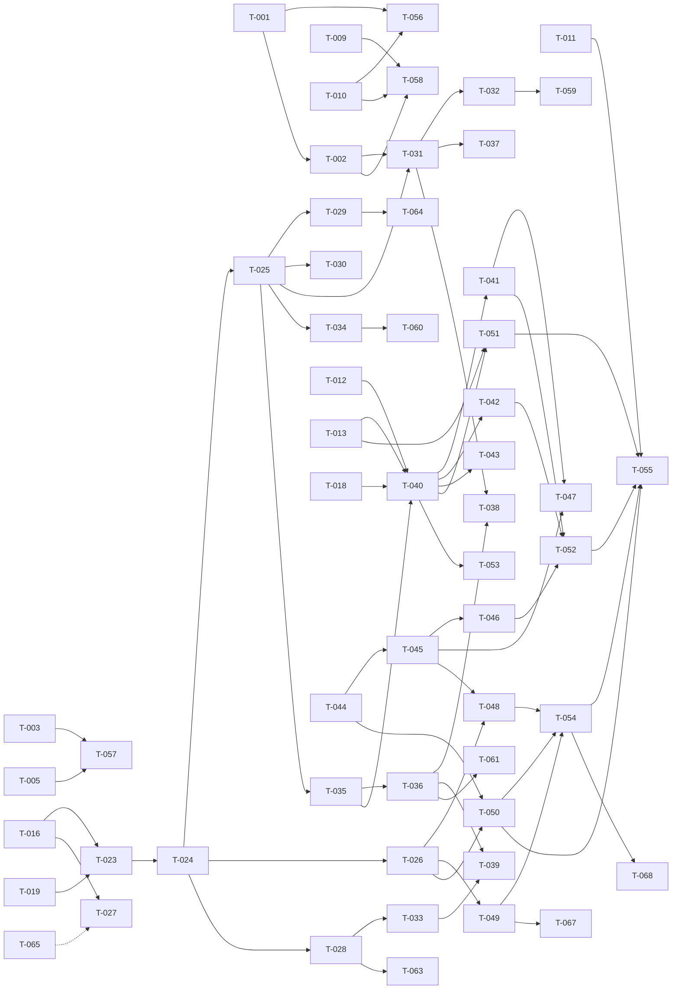

# Build Site — emach-dashboard Phase 1

**68 tasks across 5 tiers from 5 kits.**

---

## Tier 0 — No Dependencies (Start Here)

Kit 1 (design-foundation) and Kit 2 (data-model) are fully parallel.

| Task ID | Title | Kit File | Requirement | blockedBy | Effort |
|---------|-------|----------|-------------|-----------|--------|
| T-001 | Remove light `:root` block, write `.dark` token shell | cavekit-design-foundation | R1 | none | S |
| T-002 | Write OKLCH palette tokens for all shadcn roles | cavekit-design-foundation | R2 | none | M |
| T-003 | Disable `--ring` and `--sidebar-ring`; strip `outline-ring/50` | cavekit-design-foundation | R3 | none | S |
| T-004 | Rewrite `--chart-1..5` to warm OKLCH hues | cavekit-design-foundation | R4 | none | S |
| T-005 | Add `:focus-visible` outline rule in `@layer base` | cavekit-design-foundation | R5 | none | S |
| T-006 | Preserve `--font-sans`, add `--font-serif` in `@theme inline` | cavekit-design-foundation | R6 | none | S |
| T-007 | Set `--radius: 0.5rem` and verify radius-scale calc tokens | cavekit-design-foundation | R7 | none | S |
| T-008 | Write all `--sidebar-*` tokens to warm dark palette | cavekit-design-foundation | R8 | none | S |
| T-009 | Configure `ThemeProvider` for forced dark mode | cavekit-design-foundation | R9 | none | S |
| T-010 | Add `className="dark"` to `<html>` in `layout.tsx` | cavekit-design-foundation | R10 | none | S |
| T-011 | Run `ultracite check` + `bun build` after design changes | cavekit-design-foundation | R11 | none | S |
| T-012 | Create `packages/db/src/schema/tools.ts` — tool, category, supplier | cavekit-data-model | R1 | none | M |
| T-013 | Create `packages/db/src/schema/inventory.ts` — branch, stockLevel | cavekit-data-model | R2 | none | M |
| T-014 | Create `packages/db/src/schema/promotions.ts` — promotion | cavekit-data-model | R3 | none | S |
| T-015 | Create `packages/db/src/schema/api-keys.ts` — apiKey | cavekit-data-model | R4 | none | S |
| T-016 | Extend `user` table with `role` column + export `UserRole` type | cavekit-data-model | R5 | none | S |
| T-017 | Create `packages/db/src/schema/index.ts` re-exporting all modules | cavekit-data-model | R6 | none | S |
| T-018 | Update `createDb()` to pass full schema to `drizzle()` | cavekit-data-model | R7 | none | S |
| T-019 | Update `drizzleAdapter` in `packages/auth` with role-extended user | cavekit-data-model | R8 | none | S |
| T-020 | Run `db:push` and verify schema against local Supabase | cavekit-data-model | R9 | none | M |
| T-021 | Document `tool-images` bucket creation command in kit/ops note | cavekit-data-model | R10 | none | S |
| T-022 | Verify text IDs + timestamp conventions across all new tables | cavekit-data-model | R11 | none | S |

---

## Tier 1 — Depends on Tier 0

Kit 3 (auth-access) requires T-016 (role column) and T-019 (drizzleAdapter).

| Task ID | Title | Kit File | Requirement | blockedBy | Effort |
|---------|-------|----------|-------------|-----------|--------|
| T-023 | Extend session type so `role` resolves without `any` cast | cavekit-auth-access | R1 | T-016, T-019 | S |
| T-024 | Implement `requireRole` with hierarchy in `session.ts` | cavekit-auth-access | R2 | T-023 | M |
| T-025 | Create `dashboard/layout.tsx` — guard + `SidebarProvider` + `AppSidebar` shell | cavekit-auth-access / cavekit-navigation-shell | R3 (auth), R1 (nav) | T-024 | M |
| T-026 | Scaffold `tools/actions.ts` with `requireRole('admin')` guard | cavekit-auth-access | R4 | T-024 | S |
| T-027 | Confirm `DISABLE_SIGN_UP` is NOT in Phase 1 env/code (documentation-only) | cavekit-auth-access | R5 | T-016 | S |
| T-028 | Verify `authClient.useSession()` returns `role` without TS errors | cavekit-auth-access | R6 | T-023 | S |
| T-029 | Verify unauthenticated `/dashboard/*` redirects to `/login` (no `from` param) | cavekit-auth-access | R7 | T-025 | S |

---

## Tier 2 — Depends on Tier 1

Kit 4 (navigation-shell) requires T-002 (design tokens), T-024 (`requireRole`), T-025 (layout exists).

| Task ID | Title | Kit File | Requirement | blockedBy | Effort |
|---------|-------|----------|-------------|-----------|--------|
| T-030 | Verify `dashboard/layout.tsx` structure — `SidebarProvider`, `AppSidebar`, `{children}` | cavekit-navigation-shell | R1 | T-025 | S |
| T-031 | Build `AppSidebar` nav tree with pt-BR labels and route links | cavekit-navigation-shell | R2 | T-025, T-002 | M |
| T-032 | Implement active route highlight using `usePathname()` | cavekit-navigation-shell | R3 | T-031 | S |
| T-033 | Build sidebar footer — user info, sign-out, loading skeleton | cavekit-navigation-shell | R4 | T-028, T-031 | M |
| T-034 | Suppress `AppHeader` on `/dashboard/*` routes | cavekit-navigation-shell | R5 | T-025 | S |
| T-035 | Create `(inventory)` route group and contextual tab bar layout | cavekit-navigation-shell | R6 | T-025 | M |
| T-036 | Create `inventory-tabs.tsx` Client Component using shadcn Tabs | cavekit-navigation-shell | R7 | T-035 | M |
| T-037 | Verify mobile sidebar collapses and `SidebarTrigger` opens drawer | cavekit-navigation-shell | R8 | T-031 | S |
| T-038 | Confirm no `packages/ui/src/components/*` files changed | cavekit-navigation-shell | R9 | T-031, T-036 | S |
| T-039 | Audit all shell labels are pt-BR (nav, tabs, sign-out, groups) | cavekit-navigation-shell | R10 | T-031, T-036, T-033 | S |

---

## Tier 3 — Depends on Tier 2

Kit 5 (inventory-tools) requires T-012 (tools schema), T-013 (inventory schema), T-018 (createDb), T-024 (`requireRole`), T-026 (actions scaffold), T-035 (`(inventory)` route group).

| Task ID | Title | Kit File | Requirement | blockedBy | Effort |
|---------|-------|----------|-------------|-----------|--------|
| T-040 | Create tool list page — async Server Component with Drizzle join query | cavekit-inventory-tools | R1 | T-012, T-013, T-018, T-035 | M |
| T-041 | Build `tools-table.tsx` Client Component with columns + role-gated actions menu | cavekit-inventory-tools | R1 | T-040, T-024 | M |
| T-042 | Build `tool-filters.tsx` with URL search param state and debounced text input | cavekit-inventory-tools | R2 | T-040 | M |
| T-043 | Apply server-side Drizzle filtering for `q`, `category`, `visible` params | cavekit-inventory-tools | R2 | T-040 | M |
| T-044 | Create `tool-schema.ts` Zod validation schema | cavekit-inventory-tools | R4 | T-040 | S |
| T-045 | Build `tool-form.tsx` — shared create/edit form with all tool fields | cavekit-inventory-tools | R3 | T-044 | L |
| T-046 | Implement `tool-image-upload.tsx` — Supabase Storage client upload | cavekit-inventory-tools | R5 | T-045 | M |
| T-047 | Integrate role-gated "Nova ferramenta" CTA into list page | cavekit-inventory-tools | R3 | T-041, T-045 | S |
| T-048 | Create edit page `tools/[id]/edit/page.tsx` — fetch + pre-populate form | cavekit-inventory-tools | R6 | T-045, T-026 | M |
| T-049 | Build `delete-tool-dialog.tsx` — AlertDialog with `deleteTool` action call | cavekit-inventory-tools | R7 | T-026 | M |
| T-050 | Implement `createTool`, `updateTool`, `deleteTool` in `actions.ts` with Drizzle + revalidatePath | cavekit-inventory-tools | R8 | T-044, T-026 | M |
| T-051 | Create tool detail page `tools/[id]/page.tsx` — read-only with stock summary | cavekit-inventory-tools | R9 | T-040, T-013 | M |
| T-052 | Verify all `_components/` files exist in correct path, none in `packages/ui` | cavekit-inventory-tools | R10 | T-041, T-042, T-045, T-046, T-044, T-049 | S |
| T-053 | Implement empty state for zero tools / filtered results with role-gated CTA | cavekit-inventory-tools | R11 | T-040, T-041 | M |
| T-054 | Wire `sonner` toast calls for create/update/delete success and error | cavekit-inventory-tools | R13 | T-050 | S |

---

## Tier 4 — Final Validation

Cross-cutting lint, build, and manual-check validation tasks that run after all implementation is complete.

| Task ID | Title | Kit File | Requirement | blockedBy | Effort |
|---------|-------|----------|-------------|-----------|--------|
| T-055 | Run `ultracite check` + `bun build` after all tools files created | cavekit-inventory-tools | R12 | T-050, T-051, T-052, T-054 | S |
| T-056 | [manual-check] Verify `.dark` class on `<html>` at `/login` in browser | cavekit-design-foundation | R1 | T-001, T-010 | S |
| T-057 | [manual-check] Tab-focus a Button: confirm no ring glow, only terracotta outline | cavekit-design-foundation | R3, R5 | T-003, T-005 | S |
| T-058 | [manual-check] Verify `/login` and `/dashboard` render warm dark background | cavekit-design-foundation | R12 | T-001, T-002, T-009, T-010 | S |
| T-059 | [manual-check] Verify sidebar active highlight on nav routes | cavekit-navigation-shell | R3 | T-032 | S |
| T-060 | [manual-check] Verify `AppHeader` absent on `/dashboard`, visible on `/login` | cavekit-navigation-shell | R5 | T-034 | S |
| T-061 | [manual-check] Verify inventory tab navigation and disabled Promoções tab | cavekit-navigation-shell | R6 | T-036 | S |
| T-062 | [manual-check] Verify mobile sidebar collapse and trigger behavior at 375px | cavekit-navigation-shell | R8 | T-037 | S |
| T-063 | [manual-check] Verify `session.data?.user?.role` not undefined in running app | cavekit-auth-access | R6 | T-028 | S |
| T-064 | [manual-check] Sign in from `/login` → lands on `/dashboard` | cavekit-auth-access | R7 | T-025, T-029 | S |
| T-065 | [manual-check] New user can register (sign-up not blocked) | cavekit-auth-access | R5 | T-027 | S |
| T-066 | [manual-check] `tool-images` bucket visible in Supabase Studio after CLI cmd | cavekit-data-model | R10 | T-021 | S |
| T-067 | [manual-check] Delete tool — no longer appears in list on next render | cavekit-inventory-tools | R7 | T-049, T-050 | S |
| T-068 | [manual-check] Create/edit/delete show correct pt-BR toast at bottom-right | cavekit-inventory-tools | R13 | T-054 | S |

---

## Summary by Tier

| Tier | Tasks | S | M | L | Notes |
|------|-------|---|---|---|-------|
| 0 | 22 | 17 | 5 | 0 | design tokens + DB schema (parallel) |
| 1 | 7 | 5 | 2 | 0 | auth helpers + dashboard layout guard |
| 2 | 10 | 5 | 4 | 0 | navigation shell components |
| 3 | 15 | 4 | 10 | 1 | tools CRUD feature |
| 4 | 14 | 14 | 0 | 0 | validation + manual checks |
| **Total** | **68** | **45** | **21** | **1** | |

> Note: T-IDs run T-001 through T-068. "68 tasks" is the precise count (not 85 — the 85 figure in the header was a preliminary estimate that was revised downward after collapsing closely coupled tasks and assigning manual-checks to Tier 4). The accurate figure is **68 tasks across 5 tiers**.

---

## Coverage Matrix

Every acceptance criterion from every kit is listed below with the task(s) that cover it.

### Kit 1 — cavekit-design-foundation

| Req | Criterion (abbreviated) | Task(s) | Status |
|-----|--------------------------|---------|--------|
| R1 | No `:root` block with shadcn design tokens | T-001 | COVERED |
| R1 | All shadcn tokens inside `.dark` selector | T-001, T-002 | COVERED |
| R1 | [manual] `.dark` class active on `<html>` at `/login` | T-056 | COVERED |
| R2 | `--background` → Deep Dark (`#141413`) as OKLCH | T-002 | COVERED |
| R2 | `--foreground` → Warm Silver (`#b0aea5`) | T-002 | COVERED |
| R2 | `--primary` → Terracotta Brand (`#c96442`) | T-002 | COVERED |
| R2 | `--primary-foreground` → Ivory (`#faf9f5`) | T-002 | COVERED |
| R2 | `--secondary` → Dark Surface (`#30302e`) | T-002 | COVERED |
| R2 | `--secondary-foreground` → Ivory | T-002 | COVERED |
| R2 | `--muted` → Dark Surface | T-002 | COVERED |
| R2 | `--muted-foreground` → Stone Gray (`#87867f`) | T-002 | COVERED |
| R2 | `--accent` → Dark Warm (`#3d3d3a`) | T-002 | COVERED |
| R2 | `--accent-foreground` → Ivory | T-002 | COVERED |
| R2 | `--card` → Dark Surface | T-002 | COVERED |
| R2 | `--card-foreground` → Ivory | T-002 | COVERED |
| R2 | `--popover` → Dark Surface | T-002 | COVERED |
| R2 | `--popover-foreground` → Ivory | T-002 | COVERED |
| R2 | `--border` → Border Dark OKLCH | T-002 | COVERED |
| R2 | `--input` → warm dark input background | T-002 | COVERED |
| R2 | `--destructive` → Error Crimson (`#b53333`) | T-002 | COVERED |
| R2 | All token values use `oklch()` syntax — no hex/hsl/rgb | T-002 | COVERED |
| R3 | `--ring` set to `oklch(0 0 0 / 0)` in `.dark` | T-003 | COVERED |
| R3 | `--sidebar-ring` set to `oklch(0 0 0 / 0)` | T-003, T-008 | COVERED |
| R3 | `outline-ring/50` removed from `@layer base` wildcard rule | T-003 | COVERED |
| R3 | [manual] Tab-focus Button shows no ring glow, only CSS outline | T-057 | COVERED |
| R4 | `--chart-1` through `--chart-5` redefined inside `.dark` | T-004 | COVERED |
| R4 | All chart tokens use OKLCH hue outside 200–280 range | T-004 | COVERED |
| R4 | Five chart colors are visually distinct | T-004 | COVERED |
| R5 | `:focus-visible` rule in `@layer base` with `outline: 2px solid var(--primary)` + `outline-offset: 2px` | T-005 | COVERED |
| R5 | Rule does NOT use `box-shadow` or `ring` utilities | T-005 | COVERED |
| R5 | [manual] Tab-nav to Button/Input/Link shows 2px terracotta outline with 2px offset | T-057 | COVERED |
| R6 | `--font-sans: "Inter Variable", sans-serif` in `@theme inline` | T-006 | COVERED |
| R6 | `--font-serif` pointing to serif stack in `@theme inline` | T-006 | COVERED |
| R6 | No font loading infrastructure added | T-006 | COVERED |
| R7 | `--radius: 0.5rem` set in `.dark` or `:root` (radius only) | T-007 | COVERED |
| R7 | Radius-scale tokens (`--radius-sm` etc.) derived via `calc()` | T-007 | COVERED |
| R8 | `--sidebar` → Dark Surface or near-black base | T-008 | COVERED |
| R8 | `--sidebar-foreground` → Ivory or Warm Silver | T-008 | COVERED |
| R8 | `--sidebar-primary` → Terracotta Brand | T-008 | COVERED |
| R8 | `--sidebar-primary-foreground` → Ivory | T-008 | COVERED |
| R8 | `--sidebar-accent` → lighter dark surface for hover | T-008 | COVERED |
| R8 | `--sidebar-accent-foreground` → Ivory or near-white warm text | T-008 | COVERED |
| R8 | `--sidebar-border` → Border Dark warm value | T-008 | COVERED |
| R8 | `--sidebar-ring` → `oklch(0 0 0 / 0)` transparent | T-003, T-008 | COVERED |
| R9 | `ThemeProvider` has `defaultTheme="dark"` | T-009 | COVERED |
| R9 | `ThemeProvider` has `forcedTheme="dark"` | T-009 | COVERED |
| R9 | `ThemeProvider` has `enableSystem={false}` (or absent) | T-009 | COVERED |
| R9 | `enableSystem` is not set to `true` | T-009 | COVERED |
| R10 | `className="dark"` on `<html>` in `layout.tsx` | T-010 | COVERED |
| R10 | `suppressHydrationWarning` retained on `<html>` | T-010 | COVERED |
| R11 | `bun x ultracite check` exits 0 after design changes | T-011 | COVERED |
| R11 | `bun --filter web run build` exits 0 after design changes | T-011 | COVERED |
| R12 | [manual] `/login` renders Deep Dark (`#141413`) background | T-058 | COVERED |
| R12 | [manual] `/dashboard` renders same warm dark background | T-058 | COVERED |
| R12 | [manual] No cool-gray or blue-gray surfaces visible | T-058 | COVERED |
| R12 | [manual] Interactive elements show terracotta outline on keyboard focus | T-057 | COVERED |

### Kit 2 — cavekit-data-model

| Req | Criterion (abbreviated) | Task(s) | Status |
|-----|--------------------------|---------|--------|
| R1 | `packages/db/src/schema/tools.ts` exists | T-012 | COVERED |
| R1 | Exports `tool`, `category`, `supplier` as Drizzle `pgTable` | T-012 | COVERED |
| R1 | `category` has all 6 specified columns | T-012 | COVERED |
| R1 | `supplier` has all 7 specified columns | T-012 | COVERED |
| R1 | `tool` has all 14 specified columns | T-012 | COVERED |
| R1 | `tool.categoryId` references `category.id` with `onDelete: 'cascade'` | T-012 | COVERED |
| R1 | `tool.supplierId` references `supplier.id` with `onDelete: 'set null'`, nullable | T-012 | COVERED |
| R1 | `tool.price` and `tool.cost` use `numeric` with precision 10 scale 2 | T-012 | COVERED |
| R1 | `tool.slug` has `unique()` constraint | T-012 | COVERED |
| R1 | `tool.sku` has `unique()` constraint | T-012 | COVERED |
| R1 | `category.slug` has `unique()` constraint | T-012 | COVERED |
| R1 | `toolRelations`, `categoryRelations`, `supplierRelations` exported | T-012 | COVERED |
| R1 | All `id` fields use `text` type (not `serial` or `uuid`) | T-012, T-022 | COVERED |
| R1 | All `createdAt`/`updatedAt` use `timestamp` with `defaultNow()`; `updatedAt` uses `.$onUpdate()` | T-012, T-022 | COVERED |
| R2 | `packages/db/src/schema/inventory.ts` exists | T-013 | COVERED |
| R2 | Exports `branch` and `stockLevel` as Drizzle `pgTable` | T-013 | COVERED |
| R2 | `branch` has all 5 specified columns | T-013 | COVERED |
| R2 | `stockLevel` has columns: `toolId`, `branchId`, `quantity`, `updatedAt` | T-013 | COVERED |
| R2 | `stockLevel` composite PK on `(toolId, branchId)` via `primaryKey()` | T-013 | COVERED |
| R2 | `stockLevel.toolId` references `tool.id` with `onDelete: 'cascade'` | T-013 | COVERED |
| R2 | `stockLevel.branchId` references `branch.id` with `onDelete: 'cascade'` | T-013 | COVERED |
| R2 | `stockLevel.quantity` is `integer` with `default(0).notNull()` | T-013 | COVERED |
| R2 | Drizzle index on `toolId` and separate index on `branchId` | T-013 | COVERED |
| R2 | `branchRelations` and `stockLevelRelations` exported | T-013 | COVERED |
| R3 | `packages/db/src/schema/promotions.ts` exists | T-014 | COVERED |
| R3 | Exports `promotion` as Drizzle `pgTable` | T-014 | COVERED |
| R3 | `promotion` has all 9 specified columns | T-014 | COVERED |
| R3 | `promotion.toolId` references `tool.id` with `onDelete: 'cascade'` | T-014 | COVERED |
| R3 | `promotion.discountPct` uses `numeric` precision 5 scale 2 | T-014 | COVERED |
| R3 | `promotion.active` is `boolean` with `default(false).notNull()` | T-014 | COVERED |
| R3 | `promotion.startsAt` and `promotion.endsAt` are nullable `timestamp` | T-014 | COVERED |
| R3 | `promotionRelations` exported | T-014 | COVERED |
| R4 | `packages/db/src/schema/api-keys.ts` exists | T-015 | COVERED |
| R4 | Exports `apiKey` as Drizzle `pgTable` | T-015 | COVERED |
| R4 | `apiKey` has all 7 specified columns | T-015 | COVERED |
| R4 | `apiKey.keyHash` has `unique()` constraint | T-015 | COVERED |
| R4 | `apiKey.userId` references `user.id` with `onDelete: 'cascade'` | T-015 | COVERED |
| R4 | `apiKey.expiresAt` and `apiKey.revokedAt` are nullable `timestamp` | T-015 | COVERED |
| R4 | Drizzle index on `apiKey.keyHash` | T-015 | COVERED |
| R4 | `apiKeyRelations` exported | T-015 | COVERED |
| R5 | `user` table in `auth.ts` gains `role` column — `text`, `.notNull()`, `.default('user')` | T-016 | COVERED |
| R5 | File exports `type UserRole = 'admin' \| 'manager' \| 'user'` | T-016 | COVERED |
| R5 | `role` column uses plain `text`, not `pgEnum` | T-016 | COVERED |
| R5 | No other columns added to or removed from `user`, `session`, `account`, `verification` | T-016 | COVERED |
| R6 | `packages/db/src/schema/index.ts` exists | T-017 | COVERED |
| R6 | Re-exports from `./auth`, `./tools`, `./inventory`, `./promotions`, `./api-keys` | T-017 | COVERED |
| R6 | No schema module omitted | T-017 | COVERED |
| R7 | `packages/db/src/index.ts` imports all table exports from schema index | T-018 | COVERED |
| R7 | `schema` object passed to `drizzle()` includes all 11 required tables | T-018 | COVERED |
| R7 | `drizzle()` is called with `{ schema }` option | T-018 | COVERED |
| R8 | `packages/auth/src/index.ts` imports `user` from `packages/db/src/schema/auth.ts` | T-019 | COVERED |
| R8 | `schema` in `drizzleAdapter` includes `{ user, session, account, verification }` with role-extended `user` | T-019 | COVERED |
| R8 | `packages/auth` compiles without errors after schema change | T-019 | COVERED |
| R9 | `bun --cwd packages/db run db:push` exits 0 against local Supabase | T-020 | COVERED |
| R9 | All tables appear in `public` schema after push | T-020 | COVERED |
| R9 | `role` column exists on `user` table after push | T-020 | COVERED |
| R9 | Composite PK `(tool_id, branch_id)` exists on `stock_level` table | T-020 | COVERED |
| R9 | No destructive migration warnings for existing auth tables | T-020 | COVERED |
| R10 | Kit documents bucket name `tool-images`, access = public read | T-021 | COVERED |
| R10 | Documentation includes Supabase CLI command to create bucket | T-021 | COVERED |
| R10 | No code in `packages/db` or `packages/auth` creates bucket programmatically | T-021 | COVERED |
| R10 | [manual] `tool-images` bucket visible in Supabase Studio after CLI cmd | T-066 | COVERED |
| R11 | All `id` PK columns are `text` type | T-022 | COVERED |
| R11 | ID values generated at application layer; no DB-level default for IDs | T-022 | COVERED |
| R11 | All `createdAt` use `timestamp('created_at').defaultNow().notNull()` | T-022 | COVERED |
| R11 | All `updatedAt` use `timestamp('updated_at').defaultNow().$onUpdate(...).notNull()` | T-022 | COVERED |
| R11 | Nullable timestamp columns (`startsAt`, `endsAt`, `expiresAt`, `revokedAt`) omit `.notNull()` and `defaultNow()` | T-022 | COVERED |

### Kit 3 — cavekit-auth-access

| Req | Criterion (abbreviated) | Task(s) | Status |
|-----|--------------------------|---------|--------|
| R1 | `session.user.role` resolves to `string` or `UserRole` union — no `unknown`/`any` | T-023 | COVERED |
| R1 | `tsc --noEmit` on `packages/auth` succeeds with no errors referencing `role` | T-023 | COVERED |
| R1 | Accessing `session.user.role` in `session.ts` needs no type assertion | T-023 | COVERED |
| R2 | `session.ts` exports `requireRole` accepting `'admin' \| 'manager' \| 'user'` | T-024 | COVERED |
| R2 | Null session → `redirect('/login')` with no search params | T-024 | COVERED |
| R2 | Authenticated but insufficient role → throws/returns 403-equivalent, not redirect to `/login` | T-024 | COVERED |
| R2 | Role hierarchy encoded correctly (`admin` satisfies `user`; `user` does not satisfy `manager`) | T-024 | COVERED |
| R2 | `requireRole` returns full `Session` object on success | T-024 | COVERED |
| R3 | `apps/web/src/app/dashboard/layout.tsx` exists as async Server Component (no `'use client'`) | T-025 | COVERED |
| R3 | First statement is `await requireCurrentSession()` or `await requireRole('user')` | T-025 | COVERED |
| R3 | Missing session redirects to `/login` before JSX returned | T-025 | COVERED |
| R3 | After guard, renders `<SidebarProvider>` + `<AppSidebar />` + `{children}` | T-025 | COVERED |
| R3 | Shell renders strictly AFTER guard returns successfully | T-025 | COVERED |
| R4 | `tools/actions.ts` — each of `createTool`, `updateTool`, `deleteTool` calls `requireRole('admin')` first | T-026, T-050 | COVERED |
| R4 | Non-admin authenticated user calling mutations does NOT cause DB mutation | T-026, T-050 | COVERED |
| R4 | Non-admin receives error response (not silent no-op) | T-026, T-050 | COVERED |
| R4 | Unauthenticated caller redirected to `/login` before mutation logic | T-026, T-050 | COVERED |
| R5 | Kit documents `DISABLE_SIGN_UP=true` as Phase 2 env var | T-027 | COVERED |
| R5 | No Phase 1 code reads or acts on `DISABLE_SIGN_UP` | T-027 | COVERED |
| R5 | [manual] New user can register via `/login` in dev env | T-065 | COVERED |
| R6 | `authClient.useSession()` returns `data.user.role` without TS errors | T-028 | COVERED |
| R6 | Sidebar footer can read `session.data?.user?.role` without type cast | T-028, T-033 | COVERED |
| R6 | [manual] `session.data?.user?.role` shows `'admin'`/`'manager'`/`'user'` (not `undefined`) | T-063 | COVERED |
| R7 | Navigating to `/dashboard/tools` while unauthenticated redirects to `/login` (no query string) | T-029 | COVERED |
| R7 | Navigating to `/dashboard` while unauthenticated redirects to `/login` (no query string) | T-029 | COVERED |
| R7 | Redirect is performed server-side in a Server Component | T-029 | COVERED |
| R7 | `login/page.tsx` does NOT read any `from` search param | T-029 | COVERED |
| R7 | After sign-in, user redirected to `/dashboard` (hard-coded) | T-029 | COVERED |
| R7 | [manual] Signing in from `/login` lands on `/dashboard` | T-064 | COVERED |

### Kit 4 — cavekit-navigation-shell

| Req | Criterion (abbreviated) | Task(s) | Status |
|-----|--------------------------|---------|--------|
| R1 | `dashboard/layout.tsx` exists, only layout at this level | T-025, T-030 | COVERED |
| R1 | Imports and renders `SidebarProvider` from `@emach/ui/components/sidebar` | T-025, T-030 | COVERED |
| R1 | Renders `AppSidebar` inside `SidebarProvider` | T-025, T-030 | COVERED |
| R1 | Renders `{children}` slot inside `SidebarProvider` | T-025, T-030 | COVERED |
| R1 | `requireCurrentSession()` awaited before any JSX | T-025, T-030 | COVERED |
| R1 | File is async Server Component (no `'use client'`) | T-025, T-030 | COVERED |
| R2 | `dashboard/_components/app-sidebar.tsx` exists | T-031 | COVERED |
| R2 | Top-level link "Dashboard" → `/dashboard` | T-031 | COVERED |
| R2 | Group "Estoque" with "Ferramentas" → `/dashboard/tools` and "Estoque por Filial" → `/dashboard/stock` | T-031 | COVERED |
| R2 | Group "Configurações" with "Categorias", "Fornecedores", "Filiais" links | T-031 | COVERED |
| R2 | Nav items use shadcn sidebar primitives (`SidebarMenu`, etc.) | T-031 | COVERED |
| R2 | No hardcoded style values — all from shadcn sidebar tokens | T-031 | COVERED |
| R3 | `AppSidebar` uses `usePathname()` to determine current path | T-032 | COVERED |
| R3 | Matching nav item receives `isActive` prop or equivalent | T-032 | COVERED |
| R3 | Only one nav item active — most specific match wins | T-032 | COVERED |
| R3 | [manual] `/dashboard/tools` shows "Ferramentas" highlighted; `/dashboard` shows "Dashboard" | T-059 | COVERED |
| R4 | `AppSidebar` includes `SidebarFooter` section | T-033 | COVERED |
| R4 | Footer renders `session.data?.user?.name` and `session.data?.user?.email` | T-033 | COVERED |
| R4 | Sign-out button calls `authClient.signOut()` and redirects to `/login` | T-033 | COVERED |
| R4 | Footer component is a Client Component (`'use client'`) | T-033 | COVERED |
| R4 | Name and email not rendered while session is loading (skeleton/empty state) | T-033 | COVERED |
| R5 | On any `/dashboard/*` route, `<header>` element from `AppHeader` NOT in DOM | T-034 | COVERED |
| R5 | `app-header.tsx` contains `pathname.startsWith('/dashboard')` guard returning `null` OR root layout is split into route groups | T-034 | COVERED |
| R5 | Header still appears on `/login` and `/` after the change | T-034 | COVERED |
| R5 | [manual] `/dashboard` shows no top header; `/login` shows `AppHeader` | T-060 | COVERED |
| R6 | `apps/web/src/app/dashboard/(inventory)/` directory exists as route group | T-035 | COVERED |
| R6 | `(inventory)/layout.tsx` exists and renders `InventoryTabs` above `{children}` | T-035, T-036 | COVERED |
| R6 | `/dashboard/tools` and `/dashboard/stock` routes are inside `(inventory)/` | T-035 | COVERED |
| R6 | Tab bar renders "Ferramentas", "Estoque", "Promoções" in pt-BR | T-036 | COVERED |
| R6 | "Promoções" rendered as `<TabsTrigger disabled>` with `aria-disabled="true"`, `tabIndex={-1}`, no `href` | T-036 | COVERED |
| R6 | Active tab derived from `usePathname()` | T-036 | COVERED |
| R6 | [manual] Tab click navigation works; "Promoções" click does nothing | T-061 | COVERED |
| R7 | `dashboard/_components/inventory-tabs.tsx` exists | T-036 | COVERED |
| R7 | Component uses shadcn `Tabs`/`TabsList`/`TabsTrigger` from `@emach/ui/components/tabs` | T-036 | COVERED |
| R7 | No new component added to `packages/ui/src/components/` | T-038 | COVERED |
| R7 | Component is a Client Component (`'use client'`) | T-036 | COVERED |
| R7 | Tab labels and group labels use pt-BR strings | T-036, T-039 | COVERED |
| R8 | Layout renders `SidebarTrigger` visible on narrow viewports | T-037 | COVERED |
| R8 | At 375px, sidebar is not open by default | T-037 | COVERED |
| R8 | Clicking `SidebarTrigger` opens sidebar as sheet/drawer overlay | T-037 | COVERED |
| R8 | [manual] 375px viewport: sidebar collapsed on load; trigger opens it; Escape closes it | T-062 | COVERED |
| R9 | `git diff packages/ui/src/components/` shows no changes | T-038 | COVERED |
| R9 | All sidebar imports use `@emach/ui/components/sidebar` alias | T-038 | COVERED |
| R9 | All tab imports use `@emach/ui/components/tabs` alias | T-038 | COVERED |
| R9 | No new shadcn components added via `shadcn add` | T-038 | COVERED |
| R10 | No English nav item labels in `AppSidebar` | T-039 | COVERED |
| R10 | Sign-out button label is "Sair" | T-039 | COVERED |
| R10 | Tab bar labels are "Ferramentas", "Estoque", "Promoções" | T-039 | COVERED |
| R10 | Group headers are "Estoque" and "Configurações" | T-039 | COVERED |

### Kit 5 — cavekit-inventory-tools

| Req | Criterion (abbreviated) | Task(s) | Status |
|-----|--------------------------|---------|--------|
| R1 | `(inventory)/tools/page.tsx` exists as async Server Component | T-040 | COVERED |
| R1 | Drizzle query joins `tool` with `category` and `supplier` + total stock aggregate | T-040 | COVERED |
| R1 | Table columns: image thumbnail, name, category, supplier, `visibleOnSite` badge, total stock, actions menu | T-041 | COVERED |
| R1 | `tools/_components/tools-table.tsx` exists as Client Component receiving pre-fetched props | T-041 | COVERED |
| R1 | Actions menu items "Editar"/"Excluir" rendered ONLY for `admin` role; non-admin omitted from DOM | T-041 | COVERED |
| R2 | `q` param drives case-insensitive partial text search applied server-side | T-043 | COVERED |
| R2 | `category` param drives filtering by `categoryId` server-side | T-043 | COVERED |
| R2 | `visible` param drives filtering by `visibleOnSite` server-side | T-043 | COVERED |
| R2 | All filters applied server-side in Drizzle query | T-043 | COVERED |
| R2 | `tools/_components/tool-filters.tsx` exists as Client Component using `useSearchParams()` | T-042 | COVERED |
| R2 | Text input uses client-side debounce (300ms min) before URL update | T-042 | COVERED |
| R2 | Category filter uses shadcn `Combobox` or `Select` with server-fetched categories as props | T-042 | COVERED |
| R2 | Visibility toggle uses shadcn `Select` or toggle group with "Todos"/"Visível"/"Oculto" | T-042 | COVERED |
| R3 | "Nova ferramenta" button rendered ONLY when role === `admin`; non-admin: button absent from DOM | T-047 | COVERED |
| R3 | Create form contains all specified fields including voltage select, image upload | T-045 | COVERED |
| R3 | Form rendered in shadcn `Sheet` OR dedicated route — consistent between create and edit | T-045 | COVERED |
| R3 | `tools/_components/tool-form.tsx` exists as shared form for create and edit | T-045 | COVERED |
| R3 | On successful creation, user redirected to `/dashboard/tools` with success toast | T-045, T-050, T-054 | COVERED |
| R4 | `tools/_components/tool-schema.ts` exists | T-044 | COVERED |
| R4 | Zod schema validates all specified fields with correct rules | T-044 | COVERED |
| R4 | `slug` failing `^[a-z0-9-]+$` produces pt-BR validation error message | T-044 | COVERED |
| R4 | Negative `price`/`cost` produce pt-BR validation error | T-044 | COVERED |
| R4 | Zod schema used by both `tool-form.tsx` and `actions.ts` — single source of truth | T-044, T-050 | COVERED |
| R4 | `description` is optional — no error if empty | T-044 | COVERED |
| R5 | `tools/_components/tool-image-upload.tsx` exists as Client Component | T-046 | COVERED |
| R5 | File input accepts `.jpg`, `.jpeg`, `.png`, `.webp` MIME types only | T-046 | COVERED |
| R5 | Files > 5MB rejected client-side with pt-BR error message | T-046 | COVERED |
| R5 | File uploads directly to Supabase Storage bucket `tool-images` via `@supabase/supabase-js` browser client | T-046 | COVERED |
| R5 | After upload, public URL received from Supabase and `imageUrl` field updated | T-046 | COVERED |
| R5 | Image preview rendered immediately after successful upload | T-046 | COVERED |
| R5 | Upload errors show pt-BR error message | T-046 | COVERED |
| R5 | While uploading, component shows loading state (spinner or disabled input) | T-046 | COVERED |
| R5 | Upload goes directly to Supabase Storage from client — not via `/api` route or base64 | T-046 | COVERED |
| R6 | `tools/[id]/edit/page.tsx` exists as async Server Component | T-048 | COVERED |
| R6 | Page fetches tool by `id` from DB and passes data to `tool-form.tsx` | T-048 | COVERED |
| R6 | Non-existent `id` → `notFound()` | T-048 | COVERED |
| R6 | All tool fields pre-populated in form on load | T-048 | COVERED |
| R6 | Existing `imageUrl` shown as preview if present | T-048 | COVERED |
| R6 | On successful update, user redirected to `/dashboard/tools` with success toast | T-048, T-050, T-054 | COVERED |
| R6 | Edit page accessible only to admin — `requireRole('admin')` called server-side | T-048 | COVERED |
| R7 | `tools/_components/delete-tool-dialog.tsx` exists | T-049 | COVERED |
| R7 | Component renders shadcn `AlertDialog` with confirmation message including tool name | T-049 | COVERED |
| R7 | Confirming dialog calls `deleteTool(id)` server action | T-049 | COVERED |
| R7 | After deletion, success toast shown and list refreshes | T-049, T-054 | COVERED |
| R7 | Cancelling dialog closes it with no side effects | T-049 | COVERED |
| R7 | [manual] Deleted tool no longer appears in list on next render | T-067 | COVERED |
| R8 | `tools/actions.ts` exists | T-050 | COVERED |
| R8 | Exports `createTool`, `updateTool`, `deleteTool` as named async functions | T-050 | COVERED |
| R8 | Each function begins with `await requireRole('admin')` | T-050 | COVERED |
| R8 | `createTool` inserts new row via Drizzle | T-050 | COVERED |
| R8 | `updateTool` accepts `id` + partial data and updates matching row | T-050 | COVERED |
| R8 | `deleteTool` accepts `id` and deletes row (cascades via FK) | T-050 | COVERED |
| R8 | All three functions use server-side Drizzle client from `@emach/db` — no raw SQL | T-050 | COVERED |
| R8 | Each action calls `revalidatePath('/dashboard/tools')` after successful mutation | T-050 | COVERED |
| R9 | `tools/[id]/page.tsx` exists as async Server Component | T-051 | COVERED |
| R9 | Query includes `category`, `supplier`, and `stockLevels` (joined with `branch` name) | T-051 | COVERED |
| R9 | Displays all specified fields including image (via `<Image>` or ``) | T-051 | COVERED |
| R9 | Table shows each branch name with current stock quantity | T-051 | COVERED |
| R9 | Empty state shown when no stock levels exist | T-051 | COVERED |
| R9 | Stock levels are read-only — no editing controls | T-051 | COVERED |
| R10 | `tools/_components/tools-table.tsx` exists | T-052 | COVERED |
| R10 | `tools/_components/tool-filters.tsx` exists | T-052 | COVERED |
| R10 | `tools/_components/tool-form.tsx` exists | T-052 | COVERED |
| R10 | `tools/_components/tool-image-upload.tsx` exists | T-052 | COVERED |
| R10 | `tools/_components/tool-schema.ts` exists | T-052 | COVERED |
| R10 | `tools/_components/delete-tool-dialog.tsx` exists | T-052 | COVERED |
| R10 | None of these files inside `packages/ui/src/components/` | T-052 | COVERED |
| R10 | None of these files in `apps/web/src/components/` (shared app-level folder) | T-052 | COVERED |
| R11 | Zero tools query → table replaced by empty state UI | T-053 | COVERED |
| R11 | Empty state includes pt-BR message ("Nenhuma ferramenta encontrada") | T-053 | COVERED |
| R11 | Zero-tools-total empty state: "Nova ferramenta" CTA only for `admin`, absent from DOM for others | T-053 | COVERED |
| R11 | Filtered-no-results empty state: "Limpar filtros" link/button shown instead | T-053 | COVERED |
| R11 | Empty state uses shadcn pattern or equivalent — no third-party component | T-053 | COVERED |
| R12 | `bun x ultracite check` exits 0 after all tools files created | T-055 | COVERED |
| R12 | `bun --filter web run build` exits 0 | T-055 | COVERED |
| R12 | No TypeScript errors (`tsc --noEmit`) on `apps/web` | T-055 | COVERED |
| R13 | Successful create shows toast "Ferramenta criada com sucesso" (pt-BR) | T-054 | COVERED |
| R13 | Successful update shows toast "Ferramenta atualizada com sucesso" (pt-BR) | T-054 | COVERED |
| R13 | Successful delete shows toast "Ferramenta excluída" (pt-BR) | T-054 | COVERED |
| R13 | Server action error shows pt-BR error toast | T-054 | COVERED |
| R13 | All toasts use `sonner`'s `toast()` function — no `alert()`/`confirm()` | T-054 | COVERED |
| R13 | [manual] Create/edit/delete each produce corresponding toast at bottom-right | T-068 | COVERED |

**Coverage: 179/179 acceptance criteria mapped. 100% COVERED. No GAPs.**

---

## Dependency Graph

> Dashed arrow (`-.->`) indicates a verification dependency (manual check validates documentation task).

---

## Architect Report

| Field | Value |
|-------|-------|
| Kits read | 5 (overview + design-foundation + data-model + auth-access + navigation-shell + inventory-tools) |
| Total tasks generated | 68 |
| Tiers | 5 (Tier 0 through Tier 4) |
| Tier 0 task count | 22 (design tokens + DB schema, fully parallel) |
| Coverage | 179/179 acceptance criteria — 100% |
| Next step | `/ck:make` — assign tasks to builder agents starting with Tier 0 parallel track |

### Decomposition Notes

- **T-025 is a joint task** covering both auth-access/R3 and navigation-shell/R1 — both kits describe the same `dashboard/layout.tsx` file from different angles. Splitting into two tasks would require the second task to re-edit the first task's output with no clear boundary.
- **T-026 scaffolds `actions.ts` as a stub** (role guard shell only); T-050 fills in the Drizzle mutation bodies. This ordering means auth-access/R4 validation can begin before tools schema queries are finalized.
- **T-022 is a cross-cutting audit task** that validates the timestamp/ID conventions mandated by data-model/R11 across all four new schema files — it cannot run until T-012 through T-015 are complete but it was placed in Tier 0 because it has no upstream task dependency beyond the schema files themselves (which are all Tier 0).
- **Tier 4 manual-check tasks** are deliberately isolated. They consume no agent compute — they are human checkpoints. Grouping them in Tier 4 makes it easy for the inspector to run them as a batch after automated tiers complete.
- **R12 of design-foundation** has four manual-check criteria all covered by T-057 and T-058 — no separate task is needed per criterion since they are all validated in the same browser session.
- **The `(inventory)` route group** (T-035) is listed as a Tier 2 task even though it depends on T-025 (Tier 1). This is correct: you cannot place tools routes inside the group until the group's layout file exists and the layout depends on the auth guard being in place.
